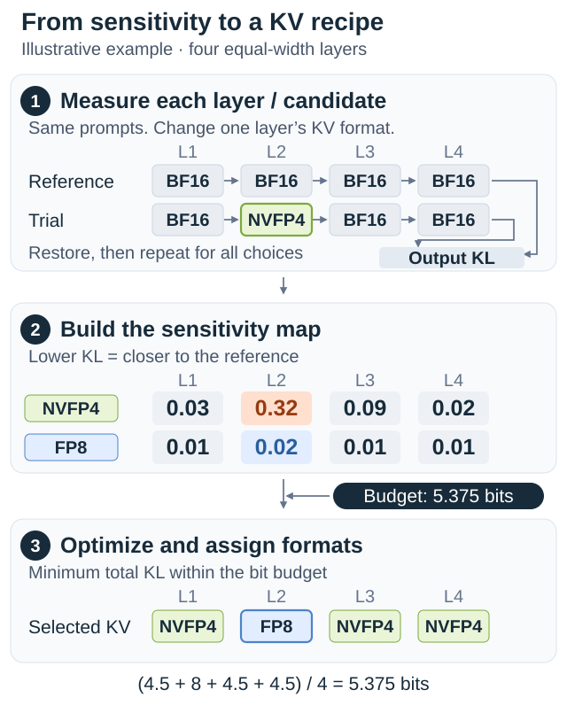
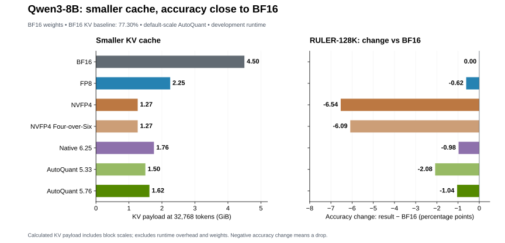
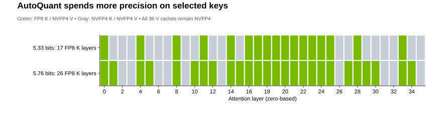

:orphan:

AutoQuant KV: Automatic Mixed-Precision KV Cache Quantization
#############################################################

:Author: Model Optimizer Team
:Date: October 8, 2026
:Tags: autoquantize, kv-cache, quantization, mixed-precision, modelopt

Introduction to AutoQuant
*************************

**AutoQuant automates mixed-precision quantization.** Instead of assigning one
format everywhere, NVIDIA Model Optimizer measures layer sensitivity and
selects formats under a storage budget. Sensitive layers retain more precision;
less sensitive layers use fewer bits.

GEMM AutoQuant applies this idea to the model's matrix multiplications.
**KV AutoQuant extends it to attention keys and values**, whose storage grows
with context length and concurrent requests. The two searches can be combined,
with independent budgets for weights and the KV cache.

Below, we explain the search workflow and API, then use Qwen3-8B as a case
study of the accuracy and memory tradeoff.

How KV AutoQuant works
**********************

KV AutoQuant searches over K/V format pairs using representative prompts and
an average-bit budget.

**Prepare candidates.** The starter recipe uses constant scales and offers FP8
K/V (8 bits) and NVFP4 K/V (4.5 bits including block scales). The case study
also includes FP8 K with NVFP4 V (6.25 bits for equal K/V widths).

**Score each choice.** Compare each isolated layer/candidate trial against a
reference with K/V quantization disabled in all eligible layers. KL divergence
measures the change in output predictions; existing GEMM quantizers stay fixed.
BF16 K/V is the reference, not an implicit solver choice.

hree layers.
   :width: 640px
   :align: center

   Layer 2 receives FP8 because its upgrade gives the largest error reduction
   within the budget. Values are illustrative, with equal K/V widths across layers.

**Select one candidate per layer.** An integer program minimizes total
sensitivity under the storage constraint:

.. math::

   \begin{gathered}
   \min_{\{c_\ell\}}\sum_\ell s_{\ell,c_\ell} \\[4pt]
   \text{subject to}\quad
   \frac{\sum_\ell w_\ell b_{\ell,c_\ell}}{\sum_\ell w_\ell} \le B.
   \end{gathered}

Here :math:`s` is KL sensitivity, :math:`b` is the width-weighted K/V bit cost
including scales, :math:`w` is the layer's total K/V width, and :math:`B` is
``effective_bits``. Layers matched by ``disabled_layers`` are preserved and
excluded from the budget.

**Apply and reuse.** Validate the assembled model on held-out tasks: summed
sensitivity is an estimate of combined error. A saved search checkpoint lets
you change the budget without rescoring, provided you restart from the same
pre-search model state and keep scoring data, candidates, and scales unchanged.

API and examples
****************

KV AutoQuant uses ``modelopt.torch.quantization.auto_quantize`` with
``cost_model="kv_cache"`` and ``method="kl_div"``. Given a Hugging Face causal
LM and a batch-size-one calibration loader yielding device-placed
``input_ids`` and ``attention_mask`` tensors:

.. code-block:: python

   import modelopt.torch.quantization as mtq
   from modelopt.recipe import load_recipe

   cfg = load_recipe(
       "general/auto_quantize/kv_fp8_nvfp4_cast_kl_div_at_5p4bits"
   ).auto_quantize

   def forward_step(model, batch):
       logits = model(**batch, use_cache=False).logits
       return logits[batch["attention_mask"].bool()]

   model, search_state = mtq.auto_quantize(
       model.eval(),
       constraints={"cost_model": "kv_cache", "effective_bits": 5.4},
       quantization_formats=[
           c.model_dump(exclude_none=True) for c in cfg.candidate_formats
       ],
       data_loader=calib_loader,
       forward_step=forward_step,
       disabled_layers=cfg.disabled_layers,
       num_calib_steps=len(calib_loader),
       num_score_steps=min(len(calib_loader), cfg.score_size),
       method="kl_div",
       checkpoint="kv_search.pth",
   )

For search **and Hugging Face export**, use the shipped example. In a CUDA
environment, install a checkout containing ModelOpt
`#2272 <https://github.com/NVIDIA/Model-Optimizer/pull/2272>`_ and
`#2273 <https://github.com/NVIDIA/Model-Optimizer/pull/2273>`_:

.. code-block:: bash

   git clone https://github.com/NVIDIA/Model-Optimizer.git Model-Optimizer-autoquant-kv
   cd Model-Optimizer-autoquant-kv
   git checkout 1d392999b45626f9c06ff0bc9797b03529fe24e3
   python -m pip install -e '.[hf]'
   python -m pip install -r examples/hf_ptq/requirements.txt

   mkdir -p outputs/qwen3-8b-kv
   python examples/hf_ptq/hf_ptq.py \
     --pyt_ckpt_path Qwen/Qwen3-8B \
     --recipe general/auto_quantize/kv_fp8_nvfp4_cast_kl_div_at_5p4bits \
     --dataset cnn_dailymail --calib_size 128 --calib_seq 512 --batch_size 1 \
     --kv_auto_quantize_checkpoint outputs/qwen3-8b-kv/search.pth \
     --export_path outputs/qwen3-8b-kv/hf

The starter recipe searches full FP8 K/V and full NVFP4 K/V with constant
scales. This small example demonstrates the workflow; use representative data
for an application recipe. Preserve ``hf_quant_config.json`` and exported
scales when serving with a compatible runtime.

Combining KV and GEMM AutoQuant
*******************************

A composed recipe runs **GEMM AutoQuant first, then KV AutoQuant**. The shipped
example uses gradient-based NVFP4/FP8 GEMM search, freezes its selected
weight/activation quantizers and calibrated tensors, then runs forward-KL KV
search. Its 5.4-bit weight and 5.4-bit KV targets constrain separate storage
domains; this is a sequential search, not one joint bit budget.

Use the command above with the following recipe and separate search-state
files, plus a fresh export directory:

.. code-block:: bash

   --recipe general/auto_quantize/nvfp4_fp8_gradient_then_kv_fp8_nvfp4_cast_kl_div_at_5p4bits \
   --auto_quantize_checkpoint gemm_search.pth \
   --kv_auto_quantize_checkpoint kv_after_gemm_search.pth

Changing the GEMM configuration requires recomputing KV sensitivity with a new
checkpoint. Fixed GEMM PTQ can also precede KV search; the
`HF PTQ guide <https://github.com/NVIDIA/Model-Optimizer/tree/main/examples/hf_ptq#autoquantize>`_
describes both compositions. Serving support must cover the combined weight
and KV formats; an export marked ``kv_cache_deployment_supported: false``
requires additional runtime support.

Mixed-precision results
***********************

In our **Qwen3-8B case study**, AQ at **5.76 effective KV bits** reduces modeled cache
payload by **64.0% versus BF16**, with a **−1.04 percentage-point change on
RULER-128K**, compared with −6.54 for uniform NVFP4. These results isolate KV
quantization: all model weights remain BF16. They do not measure the composed
GEMM+KV recipe above.

**BF16 shows accuracy (%); every recipe column shows result minus BF16 in
percentage points. Negative means an accuracy drop; positive means an
improvement.** Differences use unrounded scores. AutoQuant results use only
default K/V scales of 1.0.

.. csv-table:: Accuracy change: result − BF16 (percentage points)
   :header: "Benchmark","BF16 (%)","FP8","NVFP4","NVFP4 4/6","Native 6.25","AQ 5.33","AQ 5.76"

   "AIME2025","67.03","-0.42","—","—","-0.83","-1.88","-0.26"
   "AIME2026","66.20","+0.73","-0.05","-0.21","+1.09","+0.10","-0.63"
   "GPQA","59.15","+0.65","-1.24","-1.48","-0.58","-1.06","-0.21"
   "LiveCodeBench","55.26","+0.33","-1.90","-0.99","+0.19","-0.55","-0.55"
   "IFBench","32.87","+2.60","-1.00","-1.47","+0.93","+0.67","-0.07"
   "RULER-128K","77.30","-0.62","-6.54","-6.09","-0.98","-2.08","-1.04"
   "SciCode","20.38","-1.15","-3.48","-2.70","-0.83","-0.74","+0.10"

**Native 6.25** is a fixed mixed-precision layer map. **AQ 5.33** and
**AQ 5.76** are AutoQuant allocations at their achieved bit costs.
**NVFP4 4/6** uses Four-over-Six block-scale selection. AQ 5.76 uses **7.8% less
KV payload than Native 6.25**, with accuracy within 0.63 points of BF16 on
AIME2025, AIME2026, GPQA, LiveCodeBench, and IFBench.

The study searched FP8 K/V, FP8 K with NVFP4 V, and NVFP4 K/V. Both AQ maps keep
all values in NVFP4; 17 of 36 layers use FP8 keys at 5.33 bits, and 26 at 5.76
bits. Their requested budgets were 5.375 and 5.8125 bits.

The study used a development runtime with asymmetric K/V support, beyond the
starter recipe's candidate menu. See the
`vLLM integration <https://github.com/vllm-project/vllm/pull/56116>`_ for the
per-layer FP8/NVFP4 path. Payload calculations include block scales but exclude
runtime overhead and weights; they are not total GPU-memory or throughput measurements.

.. rst-class:: table-note

   All comparisons use the same development vLLM image (TP1/DP4) and matched
   settings per benchmark. Dashes withhold unmatched AIME2025 controls.
   SciCode counts missing/unsuccessful generations as failures in 2,704 trials
   per run; Native 6.25 averages three runs. Differences are point estimates,
   not significance claims. Study checkpoints and runtime are not distributed
   with this post.
