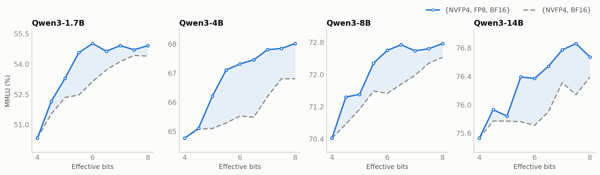

:orphan:

AutoQuantize: A Fast Automatic Mixed-Precision Assignment
#########################################################

:Authors: Asma Beevi K T, Wei Ming, Frida Hou, Juhi Mittal, Jenny Chen, Ajinkya Rasane, Meng Xin, Shengliang Xu
:Date: July 15, 2026
:Tags: autoquantize, quantization, mixed-precision, modelopt

Why do we need AutoQuantize?
****************************

LLMs carry a lot of redundancy, but not uniformly: a few layers — attention projections, the final layers of the network — are disproportionately sensitive to quantization, while most others (like MoE experts) are quite forgiving. Keeping just those few sensitive layers at higher precision (FP8 or BF16) while quantizing the rest to FP4 preserves accuracy with nearly all of FP4's memory savings and speedups. The hard part is finding *which* layers to keep — traditionally a slow pile of per-model ablation experiments.

**AutoQuantize**, part of NVIDIA's `Model Optimizer <https://github.com/NVIDIA/TensorRT-Model-Optimizer>`_ library, automates this search: given a cost budget, it scores every layer's quantization sensitivity with a fast gradient-based heuristic and finds the lowest-scoring mixed-precision assignment under that budget — no per-model ablation studies required.

How AutoQuantize works
**********************

AutoQuantize is a neural architecture search (NAS) inspired method that works in three steps: score how sensitive each operation is to quantization, model the performance cost of each available format, and solve for the best layer-wise assignment under the cost budget with a knapsack-style optimization. The sensitivity score uses a second-order Taylor approximation in the spirit of Optimal Brain Surgeon [1]_ and the output-side diagonal-Fisher reconstruction used by BRECQ [2]_; the mixed-precision allocation is inspired by LLM-MQ [3]_.

Where LLM-MQ handles only weight quantization, AutoQuantize works at the operator level — including joint weight-and-activation quantization for GEMMs — and respects real deployment constraints such as operator fusion.

AutoQuantize gradient: A fast, yet accurate sensitivity scoring
===============================================================

The sensitivity score we want is simple to state: how much the model loss changes when a layer is quantized in isolation. Measuring that directly — quantize one layer at a time, re-evaluate the whole model — requires a full model evaluation per layer per candidate format, as we'll quantify later (Table 1). We need a cheaper estimate.

Two observations give us a shortcut. First, for a trained model, a Taylor expansion of the loss around a layer's output shows the loss change from a quantization perturbation is governed by the Hessian — the local curvature. Second, following BRECQ [2]_, we approximate that Hessian with the diagonal Fisher, whose entries are squared gradients. This drops the off-diagonal terms, treating cross-coordinate contributions from the output error as negligible. Together these observations turn sensitivity into a gradient-squared-weighted output error, no explicit Hessian required.

Concretely, let :math:`Y_i` be the BF16 output of operator :math:`i`, :math:`Y_i^{Q_{i,f}}` its output under quantization format :math:`f`, :math:`g_i = \nabla_{Y_i}\mathcal{L}` the gradient at that output, and :math:`H_i` the local Hessian:

.. math::

   \mathcal{L}\!\left(Y_i^{Q_{i,f}}\right) = \mathcal{L}\!\left(Y_i\right) - g_i^{\top}\!\left(Y_i - Y_i^{Q_{i,f}}\right) + \tfrac{1}{2}\left(Y_i - Y_i^{Q_{i,f}}\right)^{\!\top} H_i \left(Y_i - Y_i^{Q_{i,f}}\right)

The first-order term vanishes in expectation for a trained model, leaving:

.. math::

   \Delta\mathcal{L}\!\left(Y_i^{Q_{i,f}}\right) = \mathcal{L}\!\left(Y_i^{Q_{i,f}}\right) - \mathcal{L}\!\left(Y_i\right) \approx \tfrac{1}{2}\left(Y_i - Y_i^{Q_{i,f}}\right)^{\!\top} H_i \left(Y_i - Y_i^{Q_{i,f}}\right)

Keeping only the Hessian diagonal and estimating it with the diagonal Fisher (squared gradients) gives the sensitivity score:

.. math::

   S(\mathrm{Op}_i, Q_{i,f}) = \Delta\mathcal{L}\!\left(Y_i^{Q_{i,f}}\right) \propto \sum_{k=1}^{d} \left(g_{i,k}\right)^2 \left(Y_{i,k} - Y_{i,k}^{Q_{i,f}}\right)^2

where :math:`d` is the feature dimension of the layer output.

The intuition: quantization perturbs the model, and the loss impact of that perturbation is the output error weighted by squared gradients. The error can be measured at the operation's immediate output or further downstream (e.g. the block output); for linear layers we use the linear-layer output. This output-side formulation is also what separates AutoQuantize from LLM-MQ, which measures error at each weight and therefore can't handle joint weight-and-activation quantization or the coupled decisions deployment-aware search needs.

Both ingredients are cheap: the output error :math:`Y_{i,k} - Y_{i,k}^{Q_{i,f}}` comes from replaying the operator's captured input through simulated quantization for each candidate format, and the gradient :math:`g_{i,k}` from one backward pass per scoring batch.

Performance cost
================

ModelOpt uses *effective bits* to model the average bit cost over AutoQuantize-eligible quantizable weights. The model includes format-provided overhead when an explicit effective-bits value is available; otherwise it estimates the cost from the format's ``num_bits``. Embeddings, norms, and other parameters outside the search are not included. Sweeping the target provides a consistent budget axis for comparing assignments.

Putting it together
===================

Following the effective-bits objective above, AutoQuantize solves the constrained optimization

.. math::

   \min_{\{f\}} \sum_i S(\mathrm{Op}_i, Q_{i,f}) \quad \text{s.t.} \quad \sum_i N_{\mathrm{params}}(\mathrm{Op}_i) \times \mathrm{bits}(Q_{i,f}) \leq N_{\mathrm{total}} \times \bar{b},

where :math:`Q_{i,f}` is the chosen format for operator :math:`i`, :math:`\mathrm{bits}(Q_{i,f})` the modeled bit cost per eligible weight of format :math:`f`, :math:`N_{\mathrm{total}} = \sum_i N_{\mathrm{params}}(\mathrm{Op}_i)` the eligible quantizable-weight count, and :math:`\bar{b}` the user-specified average effective-bits target (e.g. :math:`\bar{b} = 4.8`). A format-provided effective-bits value includes its declared overhead; formats without one use the ``num_bits`` estimate described above. Sweeping :math:`\bar{b}` produces a budget sweep of proxy-optimal assignments.

Deployment-restriction-aware search
***********************************

A mixed-precision assignment must respect the coupling constraints of its target runtime. AutoQuantize folds selected constraints directly into the search: any restriction of the form "this group of operators takes one joint format decision" becomes a merged knapsack item with aggregated sensitivity and cost. This narrows the assignment to formats that coupled operators can share; runtime support still depends on the model, quantization formats, and documented export and deployment workflow.

Joint quantization for fused linear layers
===========================================

Inference runtimes commonly fuse each layer's Q, K, and V projections, so AutoQuantize constrains the three projections to share one format. Sensitivity remains measured at each projection's individual module output, and the three scores are aggregated for the shared-format decision:

.. math::

   S(\mathrm{Op}_{\mathrm{qkv}}, Q_{\mathrm{qkv},f}) = \sum_{p \in \{\mathrm{q},\mathrm{k},\mathrm{v}\}} S(\mathrm{Op}_p, Q_{p,f}).

The corresponding costs are aggregated in the same way. Grouping therefore changes the assignment constraint, not where QKV sensitivity is measured.

MoE layer constraints
=====================

The quantized MoE APIs in vLLM and TensorRT-LLM require all sparse experts within a layer to share one format. AutoQuantize therefore treats each layer's sparse-expert projections — every expert's ``up_proj`` and ``down_proj`` — as a single decision. For this MoE grouping, sensitivity is measured downstream at the MoE block output:

.. math::

   S(\mathrm{Op}_{\mathrm{moe}}, Q_{\mathrm{moe},f}) \propto \sum_{k=1}^{d} \left(g_{\mathrm{moe},k}\right)^2 \left(Y_{\mathrm{moe},k} - Y_{\mathrm{moe},k}^{Q_{\mathrm{moe},f}}\right)^2.

The other linear layers in the MoE block — latent projections and shared experts — are not subject to this restriction, so each is searched independently.

Results
*******

**MMLU accuracy vs. effective bits under AutoQuantize, Qwen3 1.7B/4B/8B/14B.**

The figure shows an AutoQuantize budget sweep on Qwen3 models: sweep the modeled bit budget, solve the additive sensitivity proxy at each point, and evaluate the resulting assignment on MMLU. Accuracy has an overall upward trend as the budget increases, with some non-monotonic points.

Adding FP8 to the format menu helps across the reported sweep: at every budget, searching over NVFP4, FP8, and BF16 matches or beats NVFP4 and BF16 alone. A sensitive layer doesn't need to fall back all the way to BF16 — FP8 is a good middle ground, protecting moderately sensitive layers at a fraction of the cost.

AutoQuantize gradient is fast!
==============================

Direct sensitivity measurement runs the whole model once per layer per format. KL-divergence scoring is one such direct measurement: quantize one layer, run a forward pass, and compare the output distributions of the quantized and unquantized models. For each scoring batch, the gradient method instead visits every scored module, locally replays every candidate format, and performs one backward pass. Its total work therefore scales with both layers and formats, but it avoids a full-model evaluation for every layer-format pair. On Qwen3.6-35B-A3B that is a ~51× difference (Table 1).

**Table 1. Scoring cost: gradient vs. KL divergence (lower is better).**

.. list-table::
   :header-rows: 1

   * - Scoring method
     - Scoring complexity
     - Time taken for sensitivity estimation
     - Peak GPU memory
   * - Gradient
     - :math:`O(N_{\mathrm{layers}}) \times O(N_{\mathrm{formats}})`
     - ~16 minutes
     - 29 GB
   * - KL divergence
     - :math:`O(N_{\mathrm{layers}}^2) \times O(N_{\mathrm{formats}})`
     - ~14 hours
     - 23 GB

*ModelOpt AutoQuantize supports both sensitivity scoring methods — gradient (the default) and KL divergence. Measured on 4× NVIDIA RTX 6000 Ada GPUs with 128 samples at sequence length 512. Times cover sensitivity scoring only — not the end-to-end AutoQuantize run, which also includes calibration time for each format.*

**Memory.** A backward pass is not inherently memory-heavy. With activation checkpointing, activations are recomputed on demand instead of retained for backward, trading additional compute for a smaller footprint. AutoQuantize also performs a scoring pass rather than a training step, so it needs no optimizer state or persistent weight-gradient buffers. Consequently, peak memory remains close to forward-only execution: 29 GB versus 23 GB for KL-divergence in Table 1.

How to use ModelOpt AutoQuantize
********************************

AutoQuantize is a one-call API in Model Optimizer — pass the model, a bit budget, the format menu to search over, and a calibration data loader:

.. code-block:: python

   import modelopt.torch.quantization as mtq

   model, search_state = mtq.auto_quantize(
       model,
       constraints={"effective_bits": 4.8},
       quantization_formats=[mtq.NVFP4_DEFAULT_CFG, mtq.FP8_DEFAULT_CFG],
       data_loader=calib_loader,
       forward_step=lambda model, batch: model(**batch),
       loss_func=lambda output, batch: output.loss,
       num_calib_steps=512,
       num_score_steps=128,
   )

The returned model carries the searched per-layer format assignment and is ready for export. For an end-to-end example on Hugging Face models — including the supported export workflow — see the `AutoQuantize section of the ModelOpt hf_ptq README <https://github.com/NVIDIA/TensorRT-Model-Optimizer/tree/main/examples/hf_ptq#autoquantize>`_. AutoQuantize also works on Megatron Core models — see the `AutoQuantize mixed-precision search example in Megatron-LM <https://github.com/NVIDIA/Megatron-LM/tree/main/examples/post_training/modelopt#-auto-quantize-mixed-precision-search>`_.

Next steps
**********

We are working on improving AutoQuantize in the following ways:

#. **Hardware-aware cost.** Effective bits is a fast proxy for deployment cost. Relying instead on hardware-measured costs — such as per-operator latency on the target GPU and inference runtime — would let the solver optimize for what actually matters: end-to-end inference speed.
#. **Combinatorial effects of quantization.** AutoQuantize currently scores each layer quantized in isolation, but quantization errors interact — the loss impact of quantizing two layers together is not always the sum of their individual scores. Capturing these combinatorial effects in the sensitivity estimate is the next step toward tighter accuracy at the same budget.

Conclusion
**********

AutoQuantize turns mixed-precision quantization from trial and error into a principled search: gradient-based sensitivity scoring in a single sweep, a knapsack solve under your cost budget, and selected runtime coupling constraints incorporated into the assignment. Sweep the bit budget to find your model's accuracy-vs-compression sweet spot, then follow the documented export and deployment workflow for the target model, formats, and runtime.

.. _references:

References
**********

.. [1] B. Hassibi and D. G. Stork. `Second Order Derivatives for Network Pruning: Optimal Brain Surgeon <https://proceedings.neurips.cc/paper/1992/hash/303ed4c69846ab36c2904d3ba8573050-Abstract.html>`_. *NeurIPS*, 1992.
.. [2] Y. Li, R. Gong, X. Tan, Y. Yang, P. Hu, Q. Zhang, F. Yu, W. Wang, and S. Gu. `BRECQ: Pushing the Limit of Post-Training Quantization by Block Reconstruction <https://openreview.net/forum?id=POWv6hDd9XH>`_. *ICLR*, 2021.
.. [3] S. Li, X. Ning, K. Hong, T. Liu, L. Wang, X. Li, K. Zhong, G. Dai, H. Yang, and Y. Wang. `LLM-MQ: Mixed-Precision Quantization for Efficient LLM Deployment <https://nicsefc.ee.tsinghua.edu.cn/nics_file/pdf/5c805adc-b555-499f-9882-5ca35ce674b5.pdf>`_. *NeurIPS Workshop on Efficient Natural Language and Speech Processing (ENLSP)*, 2023.
