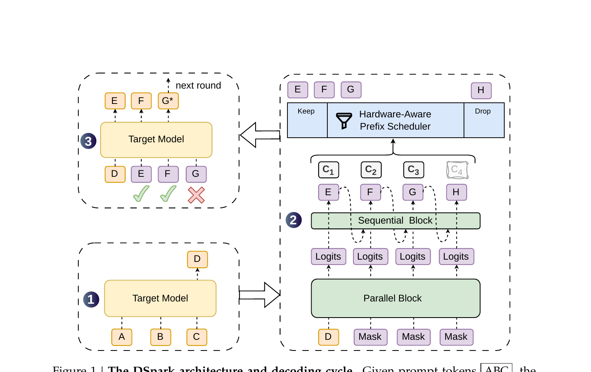
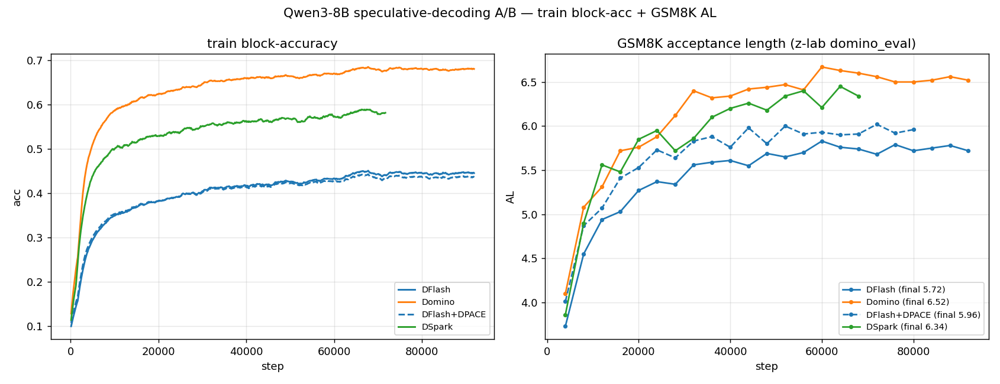
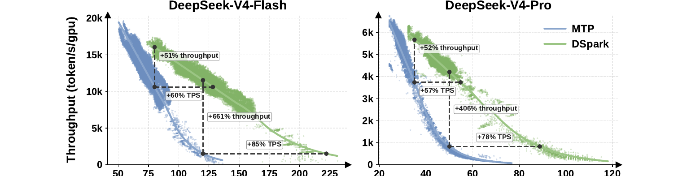

:orphan:

DSpark vs Domino: Same DFlash Backbone, Different Correction Heads
##################################################################

:Author: ModelOpt Team
:Date: July 13, 2026
:Tags: speculative-decoding, dflash, dspark, domino, architecture

DSpark (DeepSpec) and Domino both build on block-parallel DFlash draft generation but diverge sharply in their token-level correction heads. DSpark uses a stateless VanillaMarkov head that is fast and parallelizable during training; Domino uses a GRU that is more expressive but sequential at inference.
See the DSpark and Domino papers in :ref:`dspark-domino-references` for the original method descriptions.

Highlights
**********

* Both systems share the DFlash block-parallel backbone, so their parallel draft throughput starts from a similar foundation.
* DSpark defaults to VanillaMarkov: stateless ``W1`` and ``W2`` embedding lookups with no hidden state to thread through.
* Domino uses ``nn.GRU`` and carries recurrent state across draft positions.
* Both correction heads are sequential at inference because ``x_{k-1}`` must be sampled before step ``k``.
* DSpark adds a hardware-aware prefix scheduler through ``confidence_head``; Domino does not include this mechanism.

Shared Foundation: DFlash Block-Parallel Backbone
*************************************************

Both systems use DFlash: a draft backbone that runs a single causal attention forward pass over all draft positions in parallel, producing per-position hidden states and base draft logits. This is the expensive step; the correction head adds token-level adjustment on top of those outputs.

Where They Diverge: The Correction Head
***************************************

DSpark uses a first-order Markov transition. For each draft position ``k``:

.. code-block:: text

   e_{k-1} = W1[x_{k-1}]
   bias_k  = W2 * e_{k-1}
   p_k     = softmax(U_k + bias_k)
   x_k     ~ p_k

The correction at position ``k`` depends only on ``x_{k-1}``; no RNN hidden state threads across steps. The dominant work is a table lookup and projection rather than a recurrent rollout.

Domino uses a GRU correction head. A recurrent hidden state accumulates information about the draft prefix and is concatenated at readout:

.. code-block:: text

   gru_h_k = GRU(input_k, gru_h_{k-1})
   p_k     = softmax(U_k + W * [h_k; gru_h_k])
   x_k     ~ p_k

.. image:: assets/domino_fig.png
   :alt: Domino pipeline with a DFlash backbone and GRU causal correction head
   :width: 100%

The figure below compares training acceptance length on Qwen3-8B across the DFlash baseline, Domino GRU, and a DSpark implementation.

Correction Head Overhead
************************

.. list-table::
   :header-rows: 1

   * - System
     - Per-step compute
     - State carried
   * - DSpark VanillaMarkov
     - ``W1[x_{k-1}]`` plus transition projection
     - None
   * - Domino GRU
     - Full GRU cell over a high-dimensional input
     - Recurrent hidden state

Both heads must unroll left-to-right at inference. The practical difference is per-step cost: VanillaMarkov is much lighter, while the GRU can condition on a richer prefix history.

Additional DSpark Machinery
***************************

DSpark includes a hardware-aware prefix scheduler through a confidence head. The scheduler estimates acceptance probability and selects how many draft tokens to submit for verification. It is a serving-time throughput optimization, not a draft-quality feature.

For MoE models, DSpark checkpoints also include manifold-constrained Hyper-Connections. Dense models use the simpler backbone plus Markov-head path.

Takeaways
*********

#. DFlash draft generation is shared; the correction head is the main differentiator.
#. VanillaMarkov is cheaper per step than GRU, although both are sequential at inference.
#. GRU is more expressive, but the extra recurrence may not translate into a large acceptance-rate gain.
#. DSpark's design is broader: VanillaMarkov, GatedMarkov, and RNN-style heads all fit the same family.
#. The prefix scheduler affects serving throughput decisions, not correctness.

.. _dspark-domino-references:

References
**********

* Xin Cheng et al., `DSpark: Confidence-Scheduled Speculative Decoding with Semi-Autoregressive Generation <https://arxiv.org/abs/2607.05147>`_,
  arXiv:2607.05147, 2026.
* Jianuo Huang et al., `Domino: Decoupling Causal Modeling from Autoregressive Drafting in Speculative Decoding <https://arxiv.org/abs/2605.29707>`_,
  arXiv:2605.29707, 2026.

Links
*****

These public references were checked during review.

* `DeepSpec / DSpark repo <https://github.com/deepseek-ai/DeepSpec>`_
* `DeepSeek-V4-Pro-DSpark checkpoint <https://huggingface.co/deepseek-ai/DeepSeek-V4-Pro-DSpark>`_
* `Domino repo <https://github.com/jianuo-huang/Domino>`_
* `Domino checkpoint: Qwen3-8B-Domino-b16 <https://huggingface.co/Huang2020/Qwen3-8B-Domino-b16>`_
* `ModelOpt PR #1710 <https://github.com/NVIDIA/Model-Optimizer/pull/1710>`_
