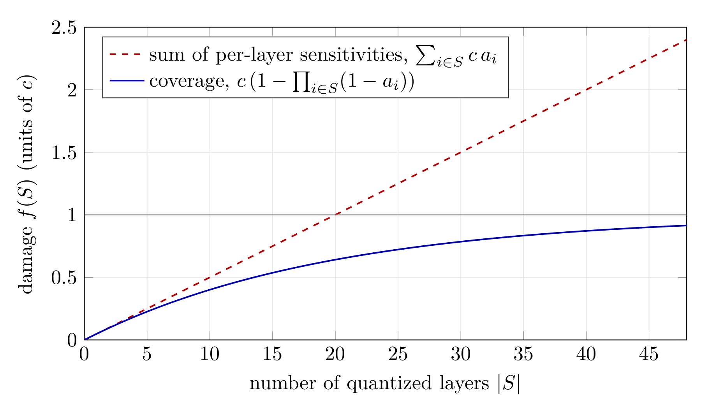

:orphan:

Saturation-Aware AutoQuantize: Pricing Mixed-Precision Configurations with Aumann–Shapley Attributions
######################################################################################################

:Author: Joshua Hill (Baseten Labs, Inc.)
:Date: September 28, 2026
:Tags: autoquantize, quantization, mixed-precision, modelopt

Introduction
************

Mixed-precision quantization keeps a model's most sensitive layers at FP8 or BF16 and pushes the rest to NVFP4. The quality of the result depends almost entirely on how a layer's sensitivity to quantization is measured. Current methods measure it in one of two ways. Some expand the loss with a low-order Taylor expansion [1]_ or use Hessian-trace scores such as HAWQ-V2 [2]_. Others quantize each layer on its own and record how much the loss moves. Both approaches score a layer with every other layer held at full precision, and then add the scores up to price a configuration.

That last step is where there's room to improve. Quantization damage *saturates*: the loss of a heavily quantized model is finite, and each additional quantized layer costs less than it would have cost on its own. The loss of quantizing two layers together is typically well below the sum of the losses of quantizing each alone.

This post describes a saturation-aware AutoQuantize method for Model Optimizer [3]_. It models the damage of quantizing any subset of layers with a closed-form *coverage* model, recovers that model's parameters from a handful of gradient passes using Aumann–Shapley path integrals, and uses a linear program to find a quantization allocation. The allocation it returns minimizes predicted damage under a memory budget, and it comes with an estimate of how much damage that allocation will cause.

Method
******

Throughout, let :math:`U = \{1, \dots, L\}` be the set of layers we consider quantizing (a single linear layer, or a group such as fused QKV that must share one format), and for :math:`S \subseteq U` let

.. math::

   f(S) = \mathbb{E}_{x}\!\left[\mathrm{KL}\!\left(p(\cdot \mid x) \,\big\|\, p_S(\cdot \mid x)\right)\right]

be the damage of quantizing the layers in :math:`S`, measured as the KL divergence from the full-precision model's next-token distribution. Scoring requires no labels, and :math:`f(\emptyset) = 0`. We describe a single target quantization format (e.g. NVFP4) first and return to multiple formats (e.g. NVFP4 and FP8) in `Solving for the configuration`_.

The coverage model
==================

The one structural assumption we make is that damage is an increasing function of a *sum* of per-layer costs,

.. math::

   f(S) = g\Big(\sum_{i \in S} b_i\Big),

for some increasing :math:`g` with :math:`g(0) = 0`. This form is not arbitrary. If the order in which layers are quantized does not matter, and quantizing a more harmful layer always causes more damage, the Aczél–Ling representation theorem [4]_ [5]_ says damage must take this form; see [3]_ for details. Summing isolated sensitivities, as existing methods do, is the special case :math:`g(u) = u`, in which layers never interact. Any concave :math:`g` instead makes each additional layer cost less as damage accumulates, which is saturation.

We use the *coverage* generator :math:`g(u) = c\,(1 - e^{-u})`, which gives

.. math::

   f(S) = c\Big(1 - \prod_{i \in S} (1 - a_i)\Big), \qquad a_i = 1 - e^{-b_i} \in [0, 1),

with a ceiling :math:`c` and a per-layer break-rate :math:`a_i`. The intuition is a budget of headroom: the loss is at most :math:`c`, and each quantized layer consumes a fixed fraction :math:`a_i` of whatever headroom remains, :math:`c - f(S \cup \{i\}) = (1 - a_i)\big(c - f(S)\big)`. Taking logarithms, the costs :math:`b_i = -\log(1 - a_i)` of the layers add up, which is the sum above. A model that is already badly damaged has little headroom left, so quantizing one more layer adds little. The marginal cost of layer :math:`i` in context :math:`S` makes this explicit:

.. math::

   f(S \cup \{i\}) - f(S) = c\, a_i \prod_{j \in S}(1 - a_j),

which shrinks as :math:`S` grows. The isolated sensitivity :math:`f(\{i\}) = c\,a_i` is the largest this marginal ever gets, and it overstates the in-context marginal by a factor of :math:`\exp\big(\sum_{j \in S} b_j\big)`, an error that compounds when isolated scores are summed over many layers (Figure 1).

The coverage model works well in practice, and it has only one parameter per layer plus the ceiling [3]_.

**Figure 1. Summed sensitivities versus coverage, illustrated with** :math:`L = 48` **layers of equal break-rate** :math:`a_i = 0.05`. Both curves agree on every single layer, but the sum of per-layer sensitivities ignores the shrinking headroom and overprices the fully quantized model by roughly 160%. The gray line is the ceiling :math:`c`.

Recovering the coverage parameters with Aumann–Shapley
======================================================

Fitting :math:`a_1, \dots, a_L` and :math:`c` by regression would require measuring the damage of many sampled configurations, one forward pass each. An alternative fitting procedure uses gradient information.

For each layer :math:`i` with output :math:`y_i`, let :math:`\delta_i = Q(y_i) - y_i` be its quantization error, and define the path

.. math::

   y_i(t) = y_i + t\,\delta_i \quad \text{for all } i \text{ simultaneously}, \qquad t \in [0, 1],

so that :math:`t = 0` is the full-precision model and :math:`t = 1` the fully quantized one. Writing :math:`F(t)` for the KL divergence at point :math:`t`, the Aumann–Shapley attribution [6]_ of layer :math:`i` is the gradient projected onto its quantization error, averaged along the path:

.. math::

   \phi_i = \int_0^1 \big\langle \nabla_{y_i} F(t),\; \delta_i \big\rangle \, dt
   \approx \frac{1}{K}\sum_{k=0}^{K-1} \big\langle \nabla_{y_i} F(t_k),\; \delta_i \big\rangle,
   \qquad t_k = \frac{k + \tfrac12}{K}.

The attributions are *complete*: by the chain rule they sum exactly to the damage of the fully quantized model, :math:`\sum_i \phi_i = F(1) - F(0) = f(U)`. Each one is measured with every other layer partly quantized, so it reflects the layer's cost in context rather than in isolation. And one backward pass at each path node produces the attributions of all :math:`L` layers at once. We use :math:`K = 2` nodes by default.

Under the coverage model, the attributions have a closed form. Integrating the gradient of the coverage model along the diagonal gives

.. math::

   \phi_i = c\, a_i \int_0^1 \prod_{j \neq i} (1 - t\, a_j)\, dt .

Given the measured :math:`\phi_i` and the ceiling :math:`c`, this is a system of :math:`L` equations in the :math:`L` break-rates, which we solve by fixed-point iteration; the integrand is a polynomial in :math:`t`, which Gauss–Legendre quadrature evaluates cheaply and to high accuracy.

The result is a break-rate :math:`a_i`, and hence a cost :math:`b_i`, for every layer, recovered from :math:`K` backward passes and one forward pass. These costs are the inputs to the allocator below.

Solving for the configuration
=============================

With several candidate formats, we run one path per format :math:`\varphi` (every layer moves toward :math:`\varphi` at once) and obtain a cost :math:`b_{i,\varphi}` for each layer and format, with :math:`b_{i,\mathrm{BF16}} = 0`. The predicted damage of an assignment :math:`\varphi(\cdot)` is then

.. math::

   \hat f = c\Big(1 - \exp\Big(-\sum_{i} b_{i,\varphi(i)}\Big)\Big).

Since :math:`\hat f` is increasing in the summed cost, minimizing it under an effective-bits budget :math:`\bar{b}` is a linear program over one-hot choices :math:`x_{i,\varphi} \in \{0,1\}`:

.. math::

   \min_{x} \sum_{i,\varphi} b_{i,\varphi}\, x_{i,\varphi}
   \quad \text{s.t.} \quad
   \sum_{\varphi} x_{i,\varphi} = 1 \;\;\forall i, \qquad
   \sum_{i,\varphi} N_i \,\mathrm{bits}(\varphi)\, x_{i,\varphi} \le \bar{b} \sum_i N_i,

where :math:`N_i` is the parameter count of layer :math:`i`. The nonlinearity of saturation lives entirely in the mapping from :math:`\sum b` to damage. The same structure supports the reverse question: finding the smallest model whose predicted damage stays below a tolerance :math:`\varepsilon`.

Results
*******

Lower damage at matched memory
==============================

Table 1 compares calibration KL divergence at matched effective bits, compared with the default gradient scoring, on two MoE models. Factoring in saturation and layer interactions results in a higher-quality quantization, with up to a 37% reduction in KL to the base model.

**Table 1. Calibration KL divergence (lower is better) of the allocation at each effective-bits budget, formats {NVFP4, FP8, BF16}.**

.. list-table::
   :header-rows: 1

   * - Model / method
     - 4.2 bits
     - 4.5 bits
     - 5.0 bits
     - 6.0 bits
     - 8.0 bits
   * - Qwen3-30B, AutoQuantize (gradient)
     - .0429
     - .0383
     - .0331
     - .0253
     - .0215
   * - Qwen3-30B, saturation-aware
     - **.0365**
     - **.0317**
     - **.0266**
     - **.0202**
     - **.0106**
   * - Qwen3-235B, AutoQuantize (gradient)
     - .0222
     - .0180
     - .0151
     - .0128
     - .0096
   * - Qwen3-235B, saturation-aware
     - **.0172**
     - **.0161**
     - **.0132**
     - **.0112**
     - **.0090**

Quoting damage before deployment
================================

Because the coverage model predicts damage rather than only ranking layers, every returned configuration carries a ``predicted_damage`` estimate.

Time and memory
===============

The scoring cost does not depend on how many configurations the solver considers. Per calibration batch, the method runs one full-precision forward pass (the reference), one fully quantized forward pass (to determine :math:`c`), and one forward-backward pass per quantization format (NVFP4 and FP8) and path node. With two quantization formats and :math:`K = 2` nodes, that is four forward-backward and two forward passes. Like the gradient method, each scored layer replays its own forward with the candidate quantizers active, so the work scales as :math:`O(N_{\mathrm{layers}} \times N_{\mathrm{formats}} \times K)`.

**Table 2. Scoring cost (lower is better).**

.. list-table::
   :header-rows: 1

   * - Scoring method
     - Passes per batch
     - Scoring time
     - Peak GPU memory
   * - Gradient (Taylor)
     - 1 fwd+bwd
     - ~16 minutes
     - 29 GB
   * - Saturation-aware
     - :math:`N_{\mathrm{formats}} K` fwd+bwd + 2 fwd
     - ~40 minutes
     - 29 GB
   * - KL divergence
     - one full model per layer and format
     - ~14 hours
     - 23 GB

*Measured on Qwen3.6-35B-A3B with 4× NVIDIA RTX 6000 Ada GPUs, 128 samples at sequence length 512.*

Usage
*****

The method is selected through the existing ``method`` argument. Because the loss is KL divergence against the model's own outputs, it needs a ``forward_step`` that returns logits, and no labels or ``loss_func``.

.. code-block:: python

   import modelopt.torch.quantization as mtq

   model, search_state = mtq.auto_quantize(
       model,
       constraints={"effective_bits": 4.8},
       quantization_formats=[mtq.NVFP4_DEFAULT_CFG, mtq.FP8_DEFAULT_CFG],
       data_loader=calib_loader,
       forward_step=lambda model, batch: model(**batch).logits,
       method={"method": "aumann_shapley", "num_path_nodes": 2},
       num_calib_steps=512,
       num_score_steps=128,
   )
   print(search_state["best"]["predicted_damage"])  # mean per-token KL

To search for the smallest configuration within a damage tolerance instead, drop the effective-bits constraint and pass ``{"method": "aumann_shapley", "max_predicted_damage": 1e-2}``.

Future work
***********

**A better proxy for inference cost.** Effective bits measures memory, and memory is not speed. Realized speedup depends on the serving stack: which formats have kernels, how layers are fused, and how often each weight is read. For an MoE model decoding at small batch, a routed expert's bytes are read far less often than an attention projection's, so two configurations with equal effective bits can differ substantially in decode throughput. Replacing effective bits with measured per-layer latency, or with weight bytes read per decoded token, would let the solver optimize the quantity users actually care about.

Conclusion
**********

Existing mixed-precision methods score each layer as if it were the only one quantized, then add the scores. Quantization damage saturates, so that sum overprices the aggressive configurations a tight budget requires. We model the damage of any subset of layers with a closed-form coverage model, in which each layer consumes a fraction of the remaining headroom, and recover its parameters from a few gradient passes along the path to the fully quantized model. The costs it produces are additive, so the allocation remains solvable with a linear program, and the result is a configuration with lower damage at the same memory, together with an estimate of what that damage will be.

References
**********

.. [1] Model Optimizer Team. `AutoQuantize: A Fast Automatic Mixed-Precision Assignment <https://nvidia.github.io/Model-Optimizer/announcements/autoquantize.html>`_. 2026.
.. [2] Z\. Dong, Z. Yao, D. Arfeen, A. Gholami, M. W. Mahoney, and K. Keutzer. HAWQ-V2: Hessian Aware Trace-Weighted Quantization of Neural Networks. *NeurIPS*, 2020.
.. [3] J\. Hill. Saturation Makes Quantization Error Additive: A Coverage Model with a Certificate. arXiv:2607.12266, 2026.
.. [4] J\. Aczél. *Lectures on Functional Equations and Their Applications*. Academic Press, 1966.
.. [5] C.-H. Ling. Representation of Associative Functions. *Publicationes Mathematicae Debrecen*, 12:189–212, 1965.
.. [6] R\. J. Aumann and L. S. Shapley. *Values of Non-Atomic Games*. Princeton University Press, 1974.
