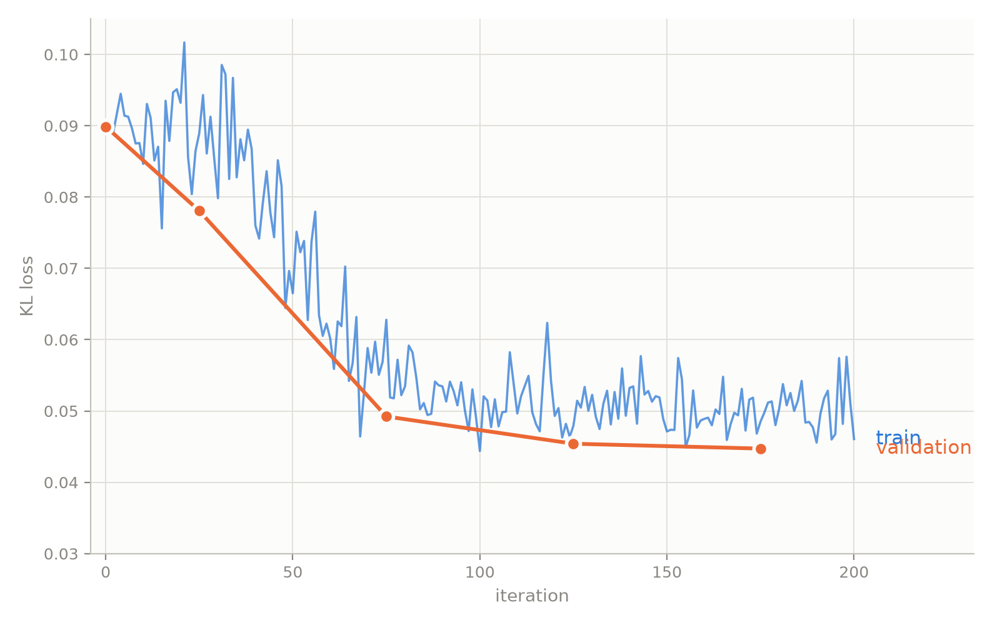

:orphan:

Scale Learning: Training NVFP4 Block Scales to Recover Accuracy
###############################################################

:Author: Model Optimizer Team
:Date: September 16, 2026
:Tags: scale-learning, quantization, nvfp4, qad, modelopt

.. role:: scale-learning-result(strong)
.. role:: table-header-note

How we set scales in blockwise quantization plays an important role in
determining the quality of the quantized model. In this blog we introduce scale
learning, which makes NVFP4 per-block scales trainable parameters and learns
optimal per-block scales through a training loop.

There are two types of scale learning: scale-only learning and full parameter
scale learning. In scale-only learning, we train only scales and leave weights
frozen. We can think of this as an enhancement of scale setting methods based on
search like MSE or Local-Hessian, where we use scale setting to initialize
scales, and then run scale-only learning to further optimize them.

In full parameter scale learning, we co-train scales and weights together. This
can serve as an enhancement of traditional Quantization-Aware Distillation (QAD)
with additional trainable parameters.

How Scale Learning Works
************************

The idea of scale learning is to make the NVFP4 per-block scales trainable. We
need to be able to compute the gradient of a loss function :math:`L` with
respect to a per-block scale :math:`s` via backpropagation. We use the usual QAT
approach, where we do fake-quantization in the forward pass and backpropagate
with straight-through estimators. During a forward pass, instead of a weight
:math:`x` we use a fake-quantized weight :math:`\tilde{x}`, given by

.. math::

   \tilde{x} = s \cdot \operatorname{clamp}\!\left(
   \operatorname{round}\!\left(\frac{x}{s}\right), q_{\min}, q_{\max}\right).

Here :math:`x` is a single weight and :math:`s` its corresponding scale
(omitting the global scale for simplicity). In NVFP4, every block of sixteen
weights shares a single scale, :math:`q_{\min}` and :math:`q_{\max}` are
:math:`-6` and :math:`6` respectively, and :math:`\operatorname{round}` rounds
to the nearest E2M1 value.

To train the scale we need :math:`\partial L/\partial s`, which we can compute
via the chain rule:

.. math::

   \frac{\partial L}{\partial s}
   = \sum_{\tilde{x} \in s\text{-block}}
     \frac{\partial L}{\partial \tilde{x}} \cdot
     \frac{\partial \tilde{x}}{\partial s}.

:math:`\partial L/\partial \tilde{x}` can be computed via backpropagation the
usual way in neural network training. To compute
:math:`\partial\tilde{x}/\partial s` we use a straight-through estimator: the
derivative of :math:`\operatorname{round}` is taken to be 1. Applying the
product rule to :math:`s \cdot \operatorname{round}\!\left(\tfrac{x}{s}\right)`
then yields

.. math::

   \frac{\partial \tilde{x}}{\partial s}
   = \begin{cases}
       q_{\min}, & \dfrac{x}{s} < q_{\min}, \\[2ex]
       \operatorname{round}\!\left(\dfrac{x}{s}\right) - \dfrac{x}{s},
         & q_{\min} \le \dfrac{x}{s} \le q_{\max}, \\[2ex]
       q_{\max}, & q_{\max} < \dfrac{x}{s}.
     \end{cases}

This is the general idea, although it is slightly more complicated since the
scale :math:`s` is also quantized (to FP8), so we have to apply straight-through
estimators there as well.

We also have a version of scale learning with "dual scales", where during fake
quantization the scale we divide by (the "pre-scale") and the scale we later
multiply by (the "post-scale") are independent. In other words,

.. math::

   \tilde{x} = s_{\mathrm{post}} \cdot \operatorname{clamp}\!\left(
   \operatorname{round}\!\left(\frac{x}{s_{\mathrm{pre}}}\right),
   q_{\min}, q_{\max}\right).

Then we can compute partial derivatives the same way as before, and obtain

.. math::

   \frac{\partial \tilde{x}}{\partial s_{\mathrm{post}}}
   = \operatorname{clamp}\!\left(
   \operatorname{round}\!\left(\frac{x}{s_{\mathrm{pre}}}\right),
   q_{\min}, q_{\max}\right)

and

.. math::

   \frac{\partial \tilde{x}}{\partial s_{\mathrm{pre}}}
   = \begin{cases}
       0, & \dfrac{x}{s_{\mathrm{pre}}} < q_{\min}, \\[2ex]
       -\,\dfrac{s_{\mathrm{post}}\, x}{s_{\mathrm{pre}}^{2}},
         & q_{\min} \le \dfrac{x}{s_{\mathrm{pre}}} \le q_{\max}, \\[2ex]
       0, & q_{\max} < \dfrac{x}{s_{\mathrm{pre}}}.
     \end{cases}

During export, the post-scale is baked into the checkpoint and the pre-scale is
discarded.

ModelOpt implements both forms via the
:func:`lsq <modelopt.torch.quantization.model_calib.lsq>` API. In the
implementation we reparameterize the trained quantity as ``amax`` rather than
the scale itself.
The field ``tied_amax`` controls whether we have dual scales or a single "tied"
scale. (i.e. we set ``tied_amax: false`` for dual scales).

Results
*******

Nemotron 3.5 Lightning
======================

Scale-only learning can significantly improve accuracy of NVFP4 quantized
Nemotron 3.5 Lightning. In this example, the PTQ recipe is W4A4 routed experts
and W8A8 attention and Mamba cache, using MSE for scale setting.

After PTQ, we run scale-only QAD. Plotting the train and validation loss, we see
stable convergence:

         0.045 by iteration 175 during W4A4 scale-only learning
   :width: 100%

Table 1 compares scale-only learning against the PTQ baseline on Nemotron 3.5
Lightning, with the BF16 model as reference, on various benchmarks.

.. list-table::
   :header-rows: 1

   * - Method
     - GPQA Diamond :table-header-note:`(w/o tools) (x8)`
     - SciCode :table-header-note:`(x8)`
     - AA-LCR :table-header-note:`(x16)`
     - HLE :table-header-note:`(w/o tools)`
     - Tau2 Telecom :table-header-note:`(x8)`
     - Tau3 Banking :table-header-note:`(x5)`
   * - BF16 reference
     - 76.45
     - 32.51
     - 52.38
     - 17.47
     - 59.65
     - 9.897
   * - PTQ
     - 73.3
     - 33.42
     - 47.38
     - 9.361
     - 59.43
     - 7.216
   * - Scale-only learning
     - 75
     - 35.42
     - 51.44
     - 10.19
     - 61.07
     - 7.216

.. rst-class:: table-note

**Table 1: Nemotron 3.5 Lightning, PTQ versus scale-only learning.** All scores
are accuracy in percent, higher is better.

Recommendations
***************

In general, we have found that scale-only learning is a highly useful technique
and outperforms traditional scale setting methods and recovers more accuracy,
across a variety of models and contexts. It improves accuracy more consistently
than QAD, which can cause regressions on benchmarks as the weights shift during
training. Full parameter scale learning can outperform ordinary QAD (i.e. with
frozen scales) for many models, but doesn't work for all models.

A higher learning rate is needed for scales: we recommend 1e-4. A smaller number
of steps (sometimes just 50) is needed for scale-only learning to converge
compared to QAT/QAD. Dual scales sometimes outperforms tied scales, but for
other models can cause distribution shift where tied scales improves accuracy:
neither is universally better.

Using Scale Learning
********************

Scale learning is a training-time algorithm: the scales are learnt during
QAT/QAD, so these recipes are not usable as calibration-only PTQ.

After scales are learnt, there is no deployment cost -- learned scales are
folded into the exported checkpoint and are the same FP8 block scales the format
already carries, so the deployed graph is unchanged.

To use it in your own configuration, set the ``algorithm`` field:

.. code-block:: python

   import modelopt.torch.quantization as mtq

   config = {
       "quant_cfg": [...],  # quantizer configuration
       "algorithm": {
           "method": "lsq",
           "learnable_amax": ["pre", "post"],
           "tied_amax": True,
           "scale_algorithm": {"method": "mse", "fp8_scale_sweep": True},
       },
   }

   model = mtq.quantize(model, config, forward_loop)

See :ref:`quant-cfg` for how to write the ``quant_cfg`` field, and the
:func:`lsq API <modelopt.torch.quantization.model_calib.lsq>` for the
calibration entry point.

This call configures fake quantization and initializes the learnable scales; it
does not train them. Continue with QAT or QAD, updating only scale parameters
for scale-only learning or both weights and scales for full parameter scale
learning.

The shipped recipes cover the two variants:

- ``modelopt_recipes/general/qad/nvfp4_lsq-mse_init-fp8_kv.yaml`` — one shared
  pre- and post-quantization scale.
- ``modelopt_recipes/general/qad/nvfp4_dual_lsq-mse_init-fp8_kv.yaml``
  — separate pre- and post-quantization scales.

With the ``examples/llm_qat`` entry points, run from that directory:

.. code-block:: bash

   # 1. Quantize. The LSQ recipe initializes the block scales with MSE and
   #    installs the learnable amax parameters.
   python quantize.py \
     --model_name_or_path Qwen/Qwen3-8B \
     --dataset_config configs/dataset/blend.yaml \
     --recipe general/qad/nvfp4_lsq-mse_init-fp8_kv \
     --output_dir qwen3-8b-lsq-quantized

   # 2. Scale-only learning. Trains just the amax parameters installed above,
   #    distilling from the BF16 model.
   accelerate launch --config-file configs/accelerate/fsdp2.yaml train.py \
     --config configs/train/qad_scale_only.yaml \
     --model_name_or_path qwen3-8b-lsq-quantized \
     --teacher_model Qwen/Qwen3-8B \
     --output_dir qwen3-8b-scale-only

   # 3. Export for deployment.
   python export.py \
     --pyt_ckpt_path qwen3-8b-scale-only \
     --export_path qwen3-8b-scale-only-deploy

For full parameter scale learning, swap the step 2 config for
``configs/train/qad_with_learnt_amax.yaml``, which trains weights and scales
together. For dual scales, swap the step 1 recipe for
``general/qad/nvfp4_dual_lsq-mse_init-fp8_kv``.

Next steps
**********

Current Model-Optimizer scale learning implementation only applies to NVFP4
per-block weight scales. In the future, we can apply the idea of scale learning
to global weight scales, or (global) input activation scales. There is potential
to optimize these through training as well.

.. _scale-learning-references:

References
**********

.. [1] E. Alvarez, O. Almog, E. Chung, S. Layton, D. Stosic, R. Krashinsky,
   and K. Aubrey. `Introducing NVFP4 for Efficient and Accurate Low-Precision
   Inference <https://developer.nvidia.com/blog/introducing-nvfp4-for-efficient-and-accurate-low-precision-inference/>`_.
   NVIDIA Technical Blog, 2025.
.. [2] S. K. Esser, J. L. McKinstry, D. Bablani, R. Appuswamy, and D. S. Modha.
   `Learned Step Size Quantization <https://arxiv.org/abs/1902.08153>`_. ICLR, 2020.
