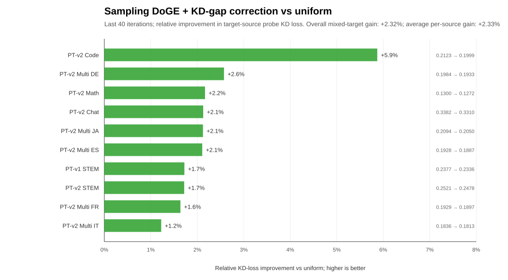
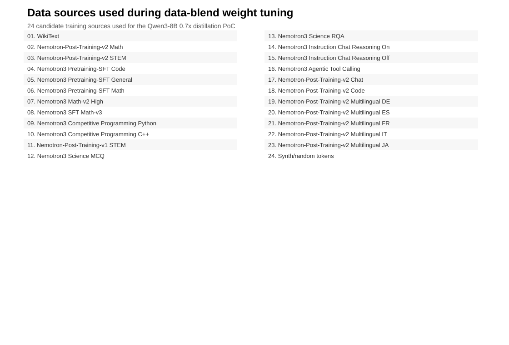
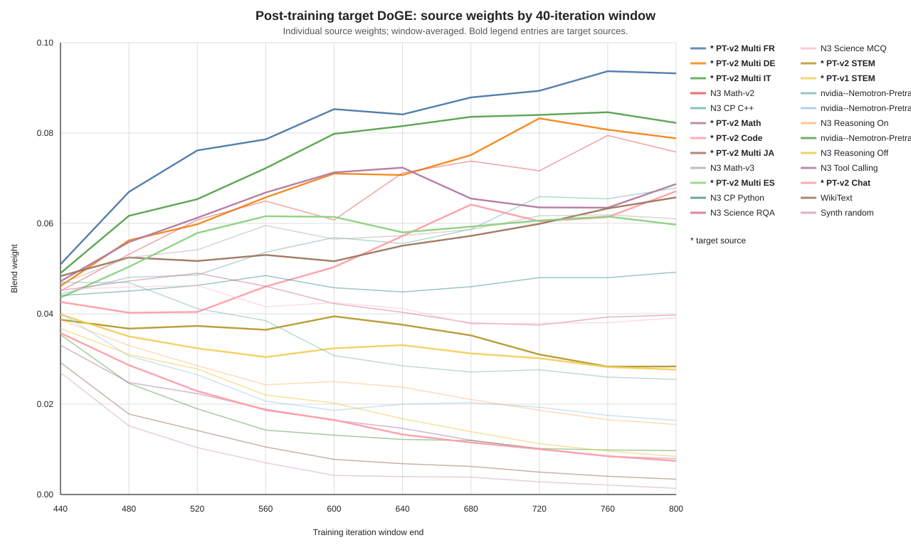
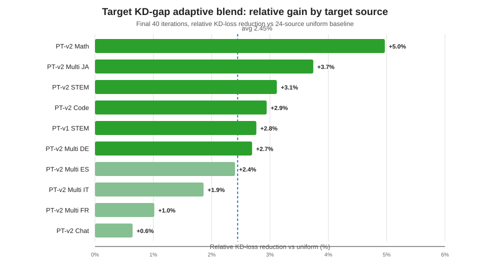

# DoGE data-blend tuning for distillation

This experimental workflow uses DoGE-style gradient alignment to tune data-blend weights for
Megatron-Bridge distillation. Use it to run a short proxy distillation experiment, update candidate
source weights against a fixed target blend, and decide which fixed blend is worth validating with a
normal `distill.py` run.

## PoC goal and status

Goal: find data-blend weights that best recover the accuracy of a Qwen3-8B 0.7x
memory-compressed/pruned student during teacher distillation.

Tuning data-blend weights for distillation improved KD loss by up to 5.0% on individual target data
sources and by 2.45% on average across 10 target data sources, compared with uniform blending
(Figure 4). The experiment used 24 training data sources (Figure 2), and the learned weights shifted
toward more useful sources during distillation (Figure 3). In the earlier setup with only 3 target
data sources, the gain was larger, around 7%.

The current PoC combines two ideas:

- [DoGE](https://arxiv.org/abs/2310.15393)-style update: adjust data-blend weights using the
  estimated effect of each source on the next distillation step.
- [PASER](https://arxiv.org/abs/2502.12594)-style signal: give more weight to sources where the
  student still has a larger KD gap from the teacher.

One important implementation detail: vanilla DoGE effectively assumes unlimited data from every
source and optimizes a weighted mixture loss. A source with a very small sampling weight may be
almost unseen, even if its weighted loss still provides a strong gradient signal. To make the PoC
closer to real distillation, we changed the training loss to sample from the data-source mixture
instead of always computing a weighted mixture loss over all sources.

The best adaptive result so far uses a target-domain KD-gap update: compute KD-gap scores for the
intersection of source domains and target domains, normalize only those target-domain scores into
blend weights, and set non-target source weights to zero. This avoids the failure mode of a naive
KD-gap update over all sources, where high-gap but irrelevant non-target sources can receive too
much mass.

We rejected the [CLIMB](https://arxiv.org/abs/2504.13161)-style approach for now because it is too
expensive. CLIMB runs a guided grid search by distilling many smaller proxy models to estimate good
blend weights, which adds substantial extra training cost before the final distillation run.

It is still unclear whether the expected downstream-task improvement justifies turning this PoC into
an MVP and validating it at scale across many compressed models. Current expectation is roughly
1-2% downstream improvement on average, but the value could be higher when distilling for a specific
target task or when a compressed model has a regression concentrated in a small number of domains.

Next steps:

1. Rerun the best target-domain KD-gap setup with a different seed to check repeatability.
2. Test a controlled auxiliary-data variant: keep the target-domain KD-gap core, but reserve a
   small non-target budget, for example 5-10%, spread uniformly or by alignment score.
3. If repeatable, decide whether the signal is strong enough to invest in an MVP and larger-scale
   validation.

Figure captions:

- Figure 1: Relative KD-loss improvement from tuned data-blend weights versus uniform blending
  across 10 target data sources.
- Figure 2: Data sources used during data-blend weight tuning.
- Figure 3: Evolution of learned data-blend weights during distillation, showing mass shifting
  toward useful target domains and away from less useful sources.
- Figure 4: Relative KD-loss improvement from target-domain KD-gap adaptive weights versus uniform
  blending across 10 target data sources.









## How DoGE works

[DoGE](https://arxiv.org/abs/2310.15393) is a bilevel data-weighting method. The inner loop trains
the student on source datasets; the outer loop updates the source blend weights using a target-data
signal.

At each DoGE step in this PoC:

1. Draw one batch from each candidate source and one batch from the target blend.
2. Compute one KD gradient per source batch and one KD gradient for the target batch.
3. Score each source by gradient alignment with the target gradient. This PoC uses cosine
   similarity.
4. Increase the relative weight of better-aligned sources and decrease the relative weight of
   weaker or opposed sources with a normalized exponentiated update.
5. Return either a weighted source KD loss or a sampled-source KD loss to Megatron-Bridge so the
   normal optimizer step updates the student.

The output is a weight trajectory in `doge_weights.jsonl`. Treat the learned weights as a hypothesis:
validate them with a standard fixed-blend distillation run and compare against fixed-blend baselines.

## Workflow

1. Prepare tokenized Megatron datasets for each candidate source.
2. Choose a target objective as Megatron `WEIGHT PATH` pairs, for example a held-out validation
   blend.
3. Run `examples/megatron_bridge/doge_distill.py` with initial source weights in `--data_paths` and
   the fixed target objective in `--target_data_paths`.
4. Inspect `doge_weights.jsonl` under `--output_dir`.
5. Run a normal `examples/megatron_bridge/distill.py` job with the selected fixed weights and the
   same target validation blend.

Example:

```bash
torchrun --nproc_per_node 8 examples/megatron_bridge/doge_distill.py \
    --tp_size 8 \
    --teacher_hf_path /path/to/teacher_hf \
    --student_hf_path /path/to/pruned_student_hf \
    --data_paths \
        0.05 /data/tokenized_wikitext_text_document \
        0.05 /data/tokenized_math_text_document \
        0.90 /data/tokenized_stem_text_document \
    --target_data_paths \
        0.50 /data/target_wikitext_text_document \
        0.25 /data/target_math_text_document \
        0.25 /data/target_stem_text_document \
    --seq_length 4096 \
    --mbs 1 \
    --gbs 1 \
    --train_iters 2448 \
    --lr 1e-4 \
    --min_lr 1e-5 \
    --lr_warmup_iters 120 \
    --eval_interval 400 \
    --eval_iters 256 \
    --log_interval 80 \
    --doge_meta_lr 0.1 \
    --output_dir /path/to/doge_run
```

`doge_weights.jsonl` records the trajectory:

```json
{"iteration": 100, "alignment_scores": {"...": 0.12}, "blend_weights": {"...": 0.54}}
```

Use the learned weights as a hypothesis, not as a final result. The final comparison should come
from a standard `distill.py` run with fixed weights and the same validation setup as the baselines.

## Virtual-step perturbation diagnostics

To debug whether the alignment score predicts target-KD improvement, run DoGE with frozen student
and frozen blend weights plus candidate virtual-step blends:

```bash
python examples/megatron_bridge/doge_distill.py \
    ... \
    --doge_freeze_student \
    --doge_freeze_blend \
    --doge_virtual_step_candidate_weights 95 2.5 2.5 \
    --doge_virtual_step_candidate_weights 90 5 5 \
    --doge_virtual_step_candidate_weights 99 0.5 0.5
```

Each candidate is interpreted in the source order from `--data_paths` and normalized. For each
candidate, DoGE temporarily applies selected-parameter virtual SGD steps using that candidate's
mixed source gradient, evaluates target KD on the same target batch, restores the parameters, and
writes `virtual_step_diagnostics` to `doge_weights.jsonl`, including the virtual update norms for
each candidate. The virtual-step learning rate defaults to `--lr` and can be overridden with
`--doge_virtual_step_lr`. The number of repeated virtual steps defaults to 1 and can be changed with
`--doge_virtual_step_num_steps`; values above 1 recompute source gradients on the same sampled
source batches after each virtual parameter update. The virtual diagnostic does not change the real
student weights or real blend weights.

By default, virtual-step diagnostics use the cheap Qwen3-8B final-MLP probe. To test whether that
proxy is too narrow, pass `--doge_alignment_param_scope all_trainable` to compute and apply virtual
steps across all trainable local parameter shards. This is much slower and is intended for short
diagnostic runs.

## Runtime compared with normal distillation

DoGE is slower per training step because each step computes gradient-alignment probes before the
normal weighted source update. With three source datasets, one target blend, Qwen3-8B teacher,
Qwen3-8B 0.7x pruned student, sequence length 4096, `gbs=mbs=1`, and eight H100 80GB GPUs, the
observed times were:

| Workflow | Approx. step time | Relative speed |
|---|---:|---:|
| Normal `distill.py` | 0.28-0.38 s/iter | 1.0x |
| `doge_distill.py` | 1.7 s/iter | about 5-6x slower |

This overhead is expected for the PoC. DoGE performs extra target/source gradient calculations to
update blend weights, while normal distillation only performs the training update.

## Qwen3-8B 0.7x PoC result

The current PoC tunes data-blend weights for a Qwen3-8B teacher and Qwen3-8B 0.7x
memory-compressed/pruned student. The larger experiment used 24 training sources and a 10-source
post-training target objective. All runs used 400 continuation iterations from the same
Wiki-recovered checkpoint, `gbs=mbs=1`, `eval_iters=256`, sequence length 4096, and eight H100 80GB
GPUs.

Lower KD is better. The best adaptive blend improved the last-40-iteration average KD loss by 2.45%
relative to the 24-source uniform baseline.

| Run | Last-40 target KD | Relative improvement vs uniform |
|---|---:|---:|
| 24-source uniform fixed blend | 0.2147 | 0.00% |
| Sampling DoGE | 0.2145 | 0.13% |
| Naive KD-gap over all sources | 0.2129 | 0.84% |
| Target-only fixed blend | 0.2108 | 1.83% |
| Manual chat-heavy target-only correction | 0.2098 | 2.32% |
| Target-domain KD-gap adaptive blend | 0.2095 | 2.45% |

The per-target-source gains for the best adaptive blend were:

| Target source | Relative improvement vs uniform |
|---|---:|
| Nemotron-Post-Training-v2 math | 5.0% |
| Nemotron-Post-Training-v2 multilingual JA | 3.7% |
| Nemotron-Post-Training-v2 STEM | 3.1% |
| Nemotron-Post-Training-v2 code | 2.9% |
| Nemotron-Post-Training-v1 STEM | 2.8% |
| Nemotron-Post-Training-v2 multilingual DE | 2.7% |
| Nemotron-Post-Training-v2 multilingual ES | 2.4% |
| Nemotron-Post-Training-v2 multilingual IT | 1.9% |
| Nemotron-Post-Training-v2 multilingual FR | 1.0% |
| Nemotron-Post-Training-v2 chat | 0.6% |

The earlier three-source target setup used WikiText, Nemotron-v2 math, and Nemotron-v2 STEM. In
that smaller setup, tuning data-blend weights produced a larger gain, around 7%.

## Current PoC limitations

- Only `gbs == mbs` is supported.
- Alignment scoring currently uses a hardcoded Qwen3-8B final MLP projection parameter.
- Pipeline parallelism and broader model-family support are not validated.
- The expected downstream-task gain is still estimated from KD loss and needs validation with
  downstream evaluations.
- The current best target-domain KD-gap result sets non-target source weights to zero; this may
  exclude useful auxiliary data, so a small non-target budget is the next ablation to test.
- The current result is from one compressed model; validating the method requires larger-scale
  experiments across multiple compressed models and target objectives.
