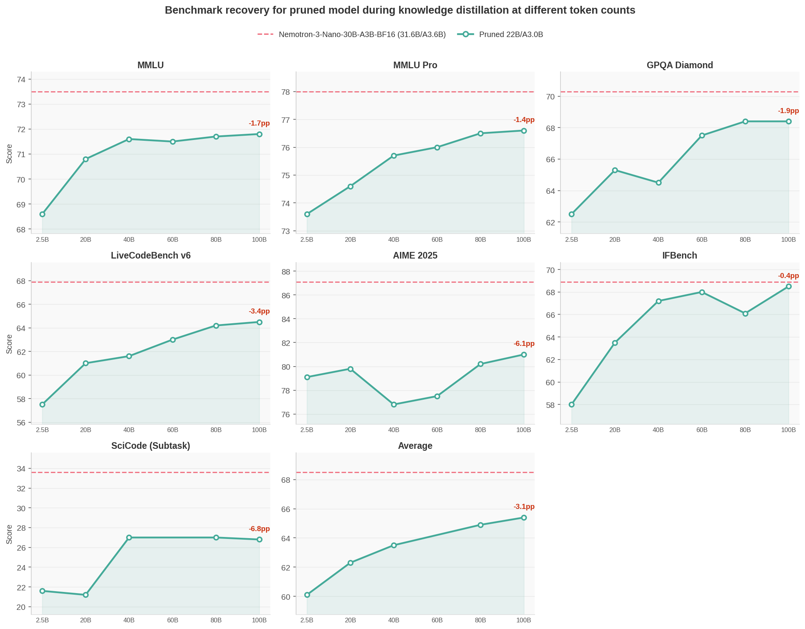

# Nemotron-3-Nano-30B-A3B: Prune + Distill + Quantize + vLLM Deployment

End-to-end optimization of [NVIDIA-Nemotron-3-Nano-30B-A3B-BF16](https://huggingface.co/nvidia/NVIDIA-Nemotron-3-Nano-30B-A3B-BF16) demonstrating how ModelOpt techniques stack: Minitron structured pruning → Megatron-Bridge knowledge distillation to recover accuracy → FP8 quantization → vLLM deployment and throughput benchmarking. This document covers:

1. **[Data Preparation](#1-data-preparation)** — tokenizing the training blend for distillation
2. **[Pruning](#2-pruning)** — Minitron structured pruning
3. **[Distillation](#3-distillation)** — recovering accuracy via Megatron-Bridge knowledge distillation
4. **[Evaluation](#4-evaluation)** — benchmarking with NeMo Evaluator across MMLU Pro, GPQA Diamond, AIME, and more
5. **[Quantization](#5-quantization)** — FP8 PTQ on the distilled checkpoint using ModelOpt's `examples/llm_ptq/hf_ptq.py` script
6. **[vLLM Inference Benchmarking](#6-vllm-inference-benchmarking)** — throughput comparison of BF16 vs FP8 on a single H100

**Environment:** Container `nvcr.io/nvidia/nemo:26.04`, ModelOpt 0.45.0. See the [Megatron-Bridge README](../../../megatron_bridge/README.md) for environment setup (including ModelOpt mount path) and container usage.

## Results



| Model | MMLU | MMLU Pro | GPQA Diamond | LiveCodeBench v6 | AIME 2025 | IFBench | SciCode (Subtask) | Average |
| --- | --- | --- | --- | --- | --- | --- | --- | --- |
| Pruned 22B/A3.0B (no distillation) | 53.4 | 47.1 | 33.5 | 27.4 | 15.5 | 37.2 | 11.4 | 32.2 |
| Distill @ 2.5B tokens (100 iters) | 68.6 | 73.6 | 62.5 | 57.5 | 79.1 | 58.0 | 21.6 | 60.1 |
| Distill @  20B tokens (800 iters) | 70.8 | 74.6 | 65.3 | 61.0 | 79.8 | 63.5 | 21.2 | 62.3 |
| Distill @  40B tokens (1600 iters) | 71.6 | 75.7 | 64.5 | 61.6 | 76.8 | 67.2 | 27.0 | 63.5 |
| Distill @  60B tokens (2400 iters) | 71.5 | 76.0 | 67.5 | 63.0 | 77.5 | 68.0 | | |
| Distill @  80B tokens (3200 iters) | 71.7 | 76.5 | 68.4 | 64.2 | 80.2 | 66.1 | 27.0 | 64.9 |
| Distill @ 100B tokens (4000 iters) | 71.8 | 76.6 | 68.4 | 64.5 | 81.0 | 68.5 | 26.8 | 65.4 |
| NVIDIA-Nemotron-3-Nano-30B-A3B-BF16 (official, 31.6B/A3.6B) | 73.5 | 78.0 | 70.3 | 67.9 | 87.1 | 68.9 | 33.6 | 68.5 |

> [!NOTE]
> Exact numbers may vary depending on deployment and evaluation setup. All models above (including the official model) were evaluated once with the same [evaluation setup](#4-evaluation) for fair comparison. These numbers may differ from those reported on the official [Nemotron-3-Nano-30B-A3B-BF16](https://huggingface.co/nvidia/NVIDIA-Nemotron-3-Nano-30B-A3B-BF16) HuggingFace model card.

---

## Steps to Reproduce

### 1. Data Preparation

See [examples/dataset/MEGATRON_DATA_PREP.md](../../../dataset/MEGATRON_DATA_PREP.md) for tokenization commands for all datasets used in this blend.

For this experiment: `TOKENIZER=nvidia/NVIDIA-Nemotron-3-Nano-30B-A3B-BF16`, `OUTPUT_DIR=tokenized_nemotron_3`.

> [!NOTE]
> Compared to experiments in [NVIDIA-Nemotron-Nano-9B-v2](../NVIDIA-Nemotron-Nano-9B-v2/README.md), we use `Nemotron-SFT-Math-v3` instead of `Nemotron-Math-v2 / high_part01` since it is higher quality with full reasoning traces.

#### Data Blend

**30% Pretraining (Code 5, General 20, MATH 5) + 70% Post-training v1/v3 (Math 30, Coding 20, Science 15, IF 5)**

| Dataset                                               | Tokens | Weight | Notes                                          |
| ----------------------------------------------------- | ------ | ------ | ---------------------------------------------- |
| Nemotron-Pretraining-SFT-v1 / Code (10M samples)      | 7B     | 5      | Pretraining code                               |
| Nemotron-Pretraining-SFT-v1 / General (10M samples)   | 16B    | 20     | Upweighted to close MMLU gap                   |
| Nemotron-Pretraining-SFT-v1 / MATH (10M samples)      | 13B    | 5      | Pretraining math                               |
| Nemotron-Math-v2 / high_part00                        | 13B    | 10     | Hard math reasoning                            |
| Nemotron-SFT-Math-v3 / train                          | 52B    | 20     | Hard math reasoning with full reasoning traces |
| Nemotron-SFT-Competitive-Programming-v2 / python_00   | 7B     | 15     | Python reasoning traces                        |
| Nemotron-SFT-Competitive-Programming-v2 / cpp_00      | 7B     | 5      | C++ reasoning traces                           |
| Nemotron-Post-Training-Dataset-v1 / stem (5M samples) | 22B    | 10     | Broad STEM                                     |
| Nemotron-Science-v1 / MCQ                             | 0.5B   | 3      | GPQA MCQ format alignment                      |
| Nemotron-Science-v1 / RQA                             | 0.3B   | 2      | GPQA format diversity                          |
| Nemotron-SFT-IF-Chat-v2 / reasoning_on                | 2B     | 3      | Instruction following (thinking on)            |
| Nemotron-SFT-IF-Chat-v2 / reasoning_off               | 1B     | 2      | Instruction following (thinking off)           |

<details>
<summary>Data blend for distillation (click to expand)</summary>

```bash
DATA_BLEND=" \
5  tokenized_nemotron_3/nvidia--Nemotron-Pretraining-SFT-v1_Nemotron-SFT-Code_train_text_max10000000 \
20 tokenized_nemotron_3/nvidia--Nemotron-Pretraining-SFT-v1_Nemotron-SFT-General_train_text_max10000000 \
5  tokenized_nemotron_3/nvidia--Nemotron-Pretraining-SFT-v1_Nemotron-SFT-MATH_train_text_max10000000 \
10 tokenized_nemotron_3/nvidia--Nemotron-Math-v2_default_high_part00_messages \
20 tokenized_nemotron_3/nvidia--Nemotron-SFT-Math-v3_default_train_messages \
15 tokenized_nemotron_3/competitive_programming_python_00_messages \
5  tokenized_nemotron_3/competitive_programming_cpp_00_messages \
10 tokenized_nemotron_3/nvidia--Nemotron-Post-Training-Dataset-v1_default_stem_messages_max5000000 \
3  tokenized_nemotron_3/MCQ_messages \
2  tokenized_nemotron_3/RQA_messages \
3  tokenized_nemotron_3/reasoning_on_messages \
2  tokenized_nemotron_3/reasoning_off_messages \
"
```

</details>

#### General Guidelines

The optimal blend is 30% pretraining and 70% post-training data. Exact proportions may vary depending on the benchmarks you care about. The blend above was designed to maximize recovery on popular General Knowledge, Reasoning, Instruction Following, and Tool Calling benchmarks. The key design decisions were:

- **30% pretraining data** closes the MMLU gap that arises from training exclusively on reasoning-heavy post-training data. The General split (20%) is upweighted specifically to recover general knowledge recall.
- **Math (30%)** is the largest post-training category because AIME and MMLU Pro respond strongly to more math reasoning tokens. We use a mix of `Nemotron-Math-v2` and `Nemotron-SFT-Math-v3` for higher quality math reasoning signal with full reasoning traces.
- **Science (15%)** uses `Nemotron-Post-Training-Dataset-v1 / stem` as the primary source for volume and GPQA stability, with small allocations to `Nemotron-Science-v1` MCQ/RQA subsets for format alignment with GPQA's multiple-choice structure.
- **Instruction following (5%)** saturates quickly so a small allocation is sufficient.

This blend intentionally omits capabilities not targeted in this experiment (e.g. long context and multilingual benchmarks). Depending on what benchmarks matter for your use case, you can substitute or add datasets from the [Nemotron Post-Training v3 collection](https://huggingface.co/collections/nvidia/nemotron-post-training-v3), for example:

| Capability | Relevant datasets |
| --- | --- |
| Multilingual | `Nemotron-SFT-Multilingual-v1` |
| Agentic / tool use | `Nemotron-SFT-Tool-Call-v1`, `Nemotron-SFT-Tool-Call-v2` |
| Software engineering (SWE) | `Nemotron-SFT-SWE-v2` |
| Safety / alignment | `Nemotron-SFT-Safety-v1` |
| Long context | `Nemotron-SFT-Long-Context-v1` |

When adding new datasets, reduce weights of lower-priority categories proportionally to keep the total at 100%.

---

### 2. Pruning

Here we prune the model from 31.6B/A3.6B to 3.0B active parameters.

Run on **1 node with 8x H100** (~1 hour)

<details>
<summary>Pruning command (click to expand)</summary>

```bash
torchrun --nproc_per_node 8 /opt/Model-Optimizer/examples/megatron_bridge/prune_minitron.py \
  --pp_size 8 \
  --hf_model_name_or_path nvidia/NVIDIA-Nemotron-3-Nano-30B-A3B-BF16 \
  --trust_remote_code \
  --prune_target_params 28e9 \
  --prune_target_active_params 3e9 \
  --hparams_to_skip num_attention_heads \
  --seq_length 8192 \
  --output_hf_path /path/to/Nemotron-3-Nano-30B-A3B-Pruned-A3.0B \
  --top_k 20 \
  --max_depth_pruning 0.15 \
  --max_width_pruning 0.30 \
  --prune_score_func mmlu_10pct_bs32 \
  --num_layers_in_first_pipeline_stage 5 \
  --num_layers_in_last_pipeline_stage 5
```

Non-default arguments:

- `--hparams_to_skip num_attention_heads` (default: none) — attention heads pruning is harder to recover, hence skipped
- `--seq_length 8192` (default: 4096) — dataset has longer sequences
- `--prune_target_active_params 3e9` — MoE-specific; the **primary** pruning constraint — targets active params rather than total params, which is what matters for MoE inference cost
- `--prune_target_params 28e9` — upper bound on total params only; the actual pruned model total can range anywhere from ~20B to 28B depending on which architecture wins — see pruning logs below for the top 20 candidates. You may also skip this argument all together for simplicity.
- `--top_k 20` (default: 10) — larger candidate pool for better architecture search
- `--max_depth_pruning 0.15` (default: 0.20) — tighter constraint since candidates with 42–46 layers universally fail for this model
- `--max_width_pruning 0.30` (default: 0.40) — tighter constraint to prevent head_dim≤48 and hidden=2048 dead zones
- `--prune_score_func mmlu_10pct_bs32` (default: `mmlu_10pct_bs1`) — batch_size=32 for ~3–4× faster candidate scoring
- `--num_layers_in_first_pipeline_stage 5 --num_layers_in_last_pipeline_stage 5` — Uneven pipeline parallelism since 52 layers is not divisible by 8 GPUs

**NOTE**: The tighter search space constraints here (`--max_depth_pruning`, `--max_width_pruning`) are specific to Nemotron hybrid models (Mamba + Attention + MoE). Unlike standard transformers which expose only layers/hidden/attention/FFN dimensions, these models add Mamba-specific dimensions (`mamba_num_heads`, `mamba_head_dim`) and MoE dimensions (`num_moe_experts`, `moe_ffn_hidden_size`, `moe_shared_expert_intermediate_size`), making the combined search space much larger. The default 40%/20% bounds cast too wide a net and waste compute on dead-zone architectures.

See [ABLATIONS.md](ABLATIONS.md#pruning) for the full architecture search analysis across various candidates.
</details>

<details>
<summary>Pruning logs (top 20 candidates, best subnet, layer patterns) (click to expand)</summary>

```text
╭──────────────────────────────────────────────────── Original Model Stats ─────────────────────────────────────────────────────╮
│ Total Parameters                              31.58B                                                                          │
│ Active Parameters                             3.58B                                                                           │
│ Memory (BF16, seq_length=8192, batch_size=1)  weights: 60230.1 MB, kv_cache: 48.0 MB, mamba_state: 23.8 MB, Total: 60301.9 MB │
╰───────────────────────────────────────────────────────────────────────────────────────────────────────────────────────────────╯

                              Search Space
                   (≤30% width / ≤15% depth pruning)
┏━━━━━━━━━━━━━━━━━━━━━━━━━━━━━━━━━━━━━┳━━━━━━━━━━━━━━━━━━━━━━━━━━━━━━━━┓
┃ Hyperparameter                      ┃ Choices                        ┃
┡━━━━━━━━━━━━━━━━━━━━━━━━━━━━━━━━━━━━━╇━━━━━━━━━━━━━━━━━━━━━━━━━━━━━━━━┩
│ num_layers                          │ [46, 48, 50, 52]               │
│ hidden_size                         │ [2048, 2304, 2560, 2688]       │
│ mamba_num_heads                     │ [48, 56, 64]                   │
│ mamba_head_dim                      │ [48, 56, 64]                   │
│ num_moe_experts                     │ [96, 104, 112, 120, 128]       │
│ moe_ffn_hidden_size                 │ [1536, 1792, 1856]             │
│ moe_shared_expert_intermediate_size │ [2816, 3072, 3328, 3584, 3712] │
├─────────────────────────────────────┼────────────────────────────────┤
│ Search space size                   │ 10800                          │
└─────────────────────────────────────┴────────────────────────────────┘

Top 20 Candidates with Scores
┏━━━━┳━━━━━━━━━━━━━━━━━━━━━━━━━━━━━━━━━━━━━━━━━━━━━━━━━━━━━━━━━━━━━━━━━━━━━━━━━━━━━━━━━━━━━━━━━━━━━━━━━━━━━━━━━━━━━━━━━━━━━━━┳━━━━━━━━━━━━━━━┳━━━━━━━━┳━━━━━━━━┓
┃  # ┃ export_config                                                                                                         ┃ active_params ┃ params ┃  score ┃
┡━━━━╇━━━━━━━━━━━━━━━━━━━━━━━━━━━━━━━━━━━━━━━━━━━━━━━━━━━━━━━━━━━━━━━━━━━━━━━━━━━━━━━━━━━━━━━━━━━━━━━━━━━━━━━━━━━━━━━━━━━━━━━╇━━━━━━━━━━━━━━━╇━━━━━━━━╇━━━━━━━━┩
│  1 │ {'num_layers': 46, 'hidden_size': 2560, 'mamba_num_heads': 56, 'mamba_head_dim': 64, 'num_moe_experts': 120,          │         3.00B │ 27.06B │ 0.3399 │
│    │ 'moe_ffn_hidden_size': 1792, 'moe_shared_expert_intermediate_size': 3072}                                             │               │        │        │
│  2 │ {'num_layers': 48, 'hidden_size': 2560, 'mamba_num_heads': 56, 'mamba_head_dim': 56, 'num_moe_experts': 112,          │         3.00B │ 25.37B │ 0.4650 │
│    │ 'moe_ffn_hidden_size': 1792, 'moe_shared_expert_intermediate_size': 3072}                                             │               │        │        │
│  3 │ {'num_layers': 46, 'hidden_size': 2560, 'mamba_num_heads': 64, 'mamba_head_dim': 56, 'num_moe_experts': 112,          │         3.00B │ 25.37B │ 0.2343 │
│    │ 'moe_ffn_hidden_size': 1792, 'moe_shared_expert_intermediate_size': 3072}                                             │               │        │        │
│  4 │ {'num_layers': 52, 'hidden_size': 2688, 'mamba_num_heads': 56, 'mamba_head_dim': 48, 'num_moe_experts': 96,           │         3.00B │ 20.09B │ 0.2552 │
│    │ 'moe_ffn_hidden_size': 1536, 'moe_shared_expert_intermediate_size': 3072}                                             │               │        │        │
│  5 │ {'num_layers': 52, 'hidden_size': 2688, 'mamba_num_heads': 48, 'mamba_head_dim': 56, 'num_moe_experts': 104,          │         3.00B │ 21.61B │ 0.2601 │
│    │ 'moe_ffn_hidden_size': 1536, 'moe_shared_expert_intermediate_size': 3072}                                             │               │        │        │
│  6 │ {'num_layers': 52, 'hidden_size': 2560, 'mamba_num_heads': 48, 'mamba_head_dim': 64, 'num_moe_experts': 96,           │         3.00B │ 19.28B │ 0.3762 │
│    │ 'moe_ffn_hidden_size': 1536, 'moe_shared_expert_intermediate_size': 3712}                                             │               │        │        │
│  7 │ {'num_layers': 52, 'hidden_size': 2304, 'mamba_num_heads': 64, 'mamba_head_dim': 64, 'num_moe_experts': 104,          │         3.00B │ 22.28B │ 0.4783 │
│    │ 'moe_ffn_hidden_size': 1856, 'moe_shared_expert_intermediate_size': 3072}                                             │               │        │        │
│  8 │ {'num_layers': 52, 'hidden_size': 2560, 'mamba_num_heads': 48, 'mamba_head_dim': 48, 'num_moe_experts': 96,           │         3.00B │ 21.99B │ 0.2420 │
│    │ 'moe_ffn_hidden_size': 1792, 'moe_shared_expert_intermediate_size': 3328}                                             │               │        │        │
│  9 │ {'num_layers': 50, 'hidden_size': 2560, 'mamba_num_heads': 48, 'mamba_head_dim': 48, 'num_moe_experts': 112,          │         3.00B │ 25.37B │ 0.2399 │
│    │ 'moe_ffn_hidden_size': 1792, 'moe_shared_expert_intermediate_size': 3712}                                             │               │        │        │
│ 10 │ {'num_layers': 50, 'hidden_size': 2560, 'mamba_num_heads': 48, 'mamba_head_dim': 48, 'num_moe_experts': 112,          │         3.00B │ 26.17B │ 0.2601 │
│    │ 'moe_ffn_hidden_size': 1856, 'moe_shared_expert_intermediate_size': 3328}                                             │               │        │        │
│ 11 │ {'num_layers': 46, 'hidden_size': 2560, 'mamba_num_heads': 56, 'mamba_head_dim': 64, 'num_moe_experts': 112,          │         3.00B │ 25.37B │ 0.2503 │
│    │ 'moe_ffn_hidden_size': 1792, 'moe_shared_expert_intermediate_size': 3072}                                             │               │        │        │
│ 12 │ {'num_layers': 48, 'hidden_size': 2560, 'mamba_num_heads': 56, 'mamba_head_dim': 56, 'num_moe_experts': 104,          │         3.00B │ 23.68B │ 0.4329 │
│    │ 'moe_ffn_hidden_size': 1792, 'moe_shared_expert_intermediate_size': 3072}                                             │               │        │        │
│ 13 │ {'num_layers': 46, 'hidden_size': 2688, 'mamba_num_heads': 64, 'mamba_head_dim': 64, 'num_moe_experts': 128,          │         3.00B │ 26.17B │ 0.2587 │
│    │ 'moe_ffn_hidden_size': 1536, 'moe_shared_expert_intermediate_size': 2816}                                             │               │        │        │
│ 14 │ {'num_layers': 46, 'hidden_size': 2560, 'mamba_num_heads': 64, 'mamba_head_dim': 56, 'num_moe_experts': 104,          │         3.00B │ 23.68B │ 0.2336 │
│    │ 'moe_ffn_hidden_size': 1792, 'moe_shared_expert_intermediate_size': 3072}                                             │               │        │        │
│ 15 │ {'num_layers': 52, 'hidden_size': 2688, 'mamba_num_heads': 48, 'mamba_head_dim': 56, 'num_moe_experts': 96,           │         3.00B │ 20.09B │ 0.2559 │
│    │ 'moe_ffn_hidden_size': 1536, 'moe_shared_expert_intermediate_size': 3072}                                             │               │        │        │
│ 16 │ {'num_layers': 52, 'hidden_size': 2304, 'mamba_num_heads': 64, 'mamba_head_dim': 64, 'num_moe_experts': 96,           │         3.00B │ 20.70B │ 0.4608 │
│    │ 'moe_ffn_hidden_size': 1856, 'moe_shared_expert_intermediate_size': 3072}                                             │               │        │        │
│ 17 │ {'num_layers': 50, 'hidden_size': 2560, 'mamba_num_heads': 48, 'mamba_head_dim': 48, 'num_moe_experts': 104,          │         3.00B │ 23.68B │ 0.2455 │
│    │ 'moe_ffn_hidden_size': 1792, 'moe_shared_expert_intermediate_size': 3712}                                             │               │        │        │
│ 18 │ {'num_layers': 50, 'hidden_size': 2560, 'mamba_num_heads': 48, 'mamba_head_dim': 48, 'num_moe_experts': 104,          │         3.00B │ 24.42B │ 0.2503 │
│    │ 'moe_ffn_hidden_size': 1856, 'moe_shared_expert_intermediate_size': 3328}                                             │               │        │        │
│ 19 │ {'num_layers': 48, 'hidden_size': 2560, 'mamba_num_heads': 48, 'mamba_head_dim': 48, 'num_moe_experts': 120,          │         3.00B │ 27.92B │ 0.2587 │
│    │ 'moe_ffn_hidden_size': 1856, 'moe_shared_expert_intermediate_size': 3712}                                             │               │        │        │
│ 20 │ {'num_layers': 46, 'hidden_size': 2560, 'mamba_num_heads': 56, 'mamba_head_dim': 64, 'num_moe_experts': 104,          │         3.00B │ 23.68B │ 0.2469 │
│    │ 'moe_ffn_hidden_size': 1792, 'moe_shared_expert_intermediate_size': 3072}                                             │               │        │        │
└────┴───────────────────────────────────────────────────────────────────────────────────────────────────────────────────────┴───────────────┴────────┴────────┘

╭──────────────────────────────────────────────────────────────────────── Best Subnet ─────────────────────────────────────────────────────────────────────────╮
│ export_config  {'num_layers': 52, 'hidden_size': 2304, 'mamba_num_heads': 64, 'mamba_head_dim': 64, 'num_moe_experts': 104, 'moe_ffn_hidden_size': 1856,     │
│                'moe_shared_expert_intermediate_size': 3072}                                                                                                  │
│ active_params  3.00B                                                                                                                                         │
│ params         22.28B                                                                                                                                        │
│ score          0.4783                                                                                                                                        │
╰──────────────────────────────────────────────────────────────────────────────────────────────────────────────────────────────────────────────────────────────╯

Original hybrid_layer_pattern: MEMEM*EMEMEM*EMEMEM*EMEMEM*EMEMEM*EMEMEMEM*EMEMEMEME
Pruned hybrid_layer_pattern:   MEMEM*EMEMEM*EMEMEM*EMEMEM*EMEMEM*EMEMEMEM*EMEMEMEME

╭───────────────────────────────────────────────────── Pruned Model Stats ──────────────────────────────────────────────────────╮
│ Total Parameters                              22.28B                                                                          │
│ Active Parameters                             3.00B                                                                           │
│ Memory (BF16, seq_length=8192, batch_size=1)  weights: 42489.7 MB, kv_cache: 48.0 MB, mamba_state: 23.8 MB, Total: 42561.6 MB │
╰───────────────────────────────────────────────────────────────────────────────────────────────────────────────────────────────╯
```

</details>

> [!TIP]
> Here we skip the Knowledge Distillation (KD) step for candidates for simplicity. If you want to find a better pruned model, you can take few top candidates' `export_config` from the logs above (where score is in similar range as the best subnet) and then export all models separately and perform KD for ~2B tokens on each of them before selecting the best subnet based on your desired metrics.

> [!NOTE]
> Copy the `nano_v3_reasoning_parser.py` file from the original HuggingFace checkpoint to the pruned model for evaluation with tool-calling below.

---

### 3. Distillation

Minimum hardware: **4 nodes × 8x H100 (32 GPUs)** — required by `TP=4 × EP=8`. On **96 nodes × 8x H100 (768 GPUs total)**, it takes ~900 H100 GPU-hours per 10B tokens (400 iters), i.e. ~70 min wall-clock per 10B tokens on 96 nodes. Full 100B token run (4k steps) takes ~9k H100 GPU-hours (~12 hours wall-clock).

<details>
<summary>Distillation command (click to expand)</summary>

```bash
python -u /opt/Model-Optimizer/examples/megatron_bridge/distill.py \
    --teacher_hf_path nvidia/NVIDIA-Nemotron-3-Nano-30B-A3B-BF16 \
    --student_hf_path /path/to/Nemotron-3-Nano-30B-A3B-Pruned-A3.0B \
    --trust_remote_code \
    --tp_size 4 \
    --pp_size 1 \
    --ep_size 8 \
    --etp_size 1 \
    --data_paths "${DATA_BLEND}" \
    --data_path_to_cache /path/to/cache \
    --seq_length 8192 \
    --mbs 1 \
    --gbs 3072 \
    --train_iters 4000 \
    --lr 1e-4 \
    --min_lr 1e-5 \
    --lr_warmup_iters 25 \
    --eval_interval 200 \
    --eval_iters 8 \
    --log_interval 10 \
    --output_dir /path/to/distill_output

# Optional: Weights & Biases logging
#     --wandb_project <wandb_project> \
#     --wandb_entity <wandb_entity> \
#     --wandb_exp_name <wandb_exp_name>
```

Non-default arguments:

- `--seq_length 8192` (default: 4096)
- `--gbs 3072` (default: 768) — matches the original Nemotron-3-Nano-30B training GBS from the paper, kept to preserve the training distribution
- `--train_iters 4000` — ~100B tokens; can stop earlier and take intermediate checkpoints
- `--lr_warmup_iters 25` (default: 50)
- `--eval_interval 200` (default: 100) — less frequent eval to save compute
- `--eval_iters 8` (default: 32) - since GBS is 4× larger than default

All other arguments use defaults.
</details>

For multi-node Slurm runs, see the [Megatron-Bridge README](../../../megatron_bridge/README.md#slurm-usage) for details.

Distillation saves checkpoints in Megatron distributed format under `<output_dir>/checkpoints/iter_XXXXXXX`. You can convert any intermediate checkpoint to HuggingFace format using the Megatron-Bridge conversion script (see [Megatron Bridge README](../../../megatron_bridge/README.md) for full details):

```bash
python /opt/Megatron-Bridge/examples/conversion/convert_checkpoints.py export \
    --hf-model /path/to/Nemotron-3-Nano-30B-A3B-Pruned-A3.0B \
    --megatron-path <output_dir>/checkpoints/iter_<iter_number> \
    --hf-path <output_dir>/checkpoints/hf_iter_<iter_number>
```

> [!NOTE]
> This is pure SFT-style distillation — no RL or online reward signal is used. Adding an RL-based post-training step after distillation is a natural next step that could further improve some of these benchmarks.

---

### 4. Evaluation

The eval config in [nemo_evaluator.yaml](nemo_evaluator.yaml) is for Slurm-based evaluation — it submits a vLLM serving job and runs evals against it. For local model execution and evaluation, refer to the [NeMo Evaluator documentation](https://docs.nvidia.com/nemo/evaluator/latest/) or this [blog](https://huggingface.co/blog/nvidia/nemotron-3-nano-evaluation-recipe).

Before running, update the following fields in the yaml or overwrite them in the command line with `-o <option>=<value>`:

- `execution.hostname` — your Slurm login node hostname
- `execution.account` — your Slurm account
- `deployment.checkpoint_path` — Hugging Face checkpoint path (original, pruned or quantized)
- `evaluation.nemo_evaluator_config.config.params.extra.tokenizer` — same path as `checkpoint_path`

> [!TIP]
> Uncomment `limit_samples` under any task to run a small subset and verify the end-to-end eval pipeline before launching full evals.

```bash
pip install "nemo-evaluator-launcher[all]==0.1.90"

# Set required environment variables:
export HF_TOKEN=<your_huggingface_token>
export SLURM_JOB_DIR=<path_to_slurm_job_output_dir>
export HF_HOME=<path_to_huggingface_cache>
export VLLM_CACHE_ROOT=<path_to_vllm_cache>

# Set additional unused but required environment variables:
export API_KEY=xxxxxx
export INFERENCE_API_KEY=xxxxxx
export OPENAI_CLIENT_ID=xxxxxx
export OPENAI_CLIENT_SECRET=xxxxxx

nemo-evaluator-launcher run --config nemo_evaluator.yaml
```

> [!TIP]
> Run same evals multiple times to get a more stable result.

**Tasks and exact metric names reported in the results table:**

| Benchmark | Library | Metric name |
| --- | --- | --- |
| MMLU | [lm-evaluation-harness](https://github.com/EleutherAI/lm-evaluation-harness) (5-shot) | `mmlu` |
| MMLU Pro | NeMo Evaluator | `mmlu-pro_pass_at_1_symbolic_correct` |
| GPQA Diamond | NeMo Evaluator | `gpqa_pass_at_1_symbolic_correct` |
| LiveCodeBench v6 | NeMo Evaluator | `livecodebench_pass_at_1_accuracy` |
| AIME 2025 | NeMo Evaluator | `aime25_pass_at_1_symbolic_correct` |
| IFBench | NeMo Evaluator | `ifbench_pass_at_1_average_score` |
| SciCode (Subtask) | NeMo Evaluator | `scicode_pass_at_1_subtask_accuracy` |

**Key vLLM settings:** Tool calling is enabled via `--enable-auto-tool-choice --tool-call-parser qwen3_coder`.

For more details on NeMo Evaluator, see the [GitHub repo](https://github.com/NVIDIA-NeMo/evaluator) and [documentation](https://docs.nvidia.com/nemo/evaluator/latest/).

---

### 5. Quantization

TODO

---

### 6. vLLM Inference Benchmarking

TODO
