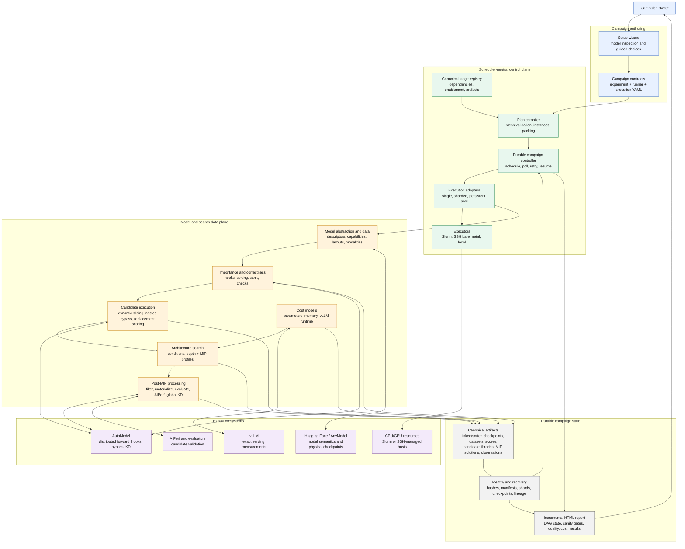
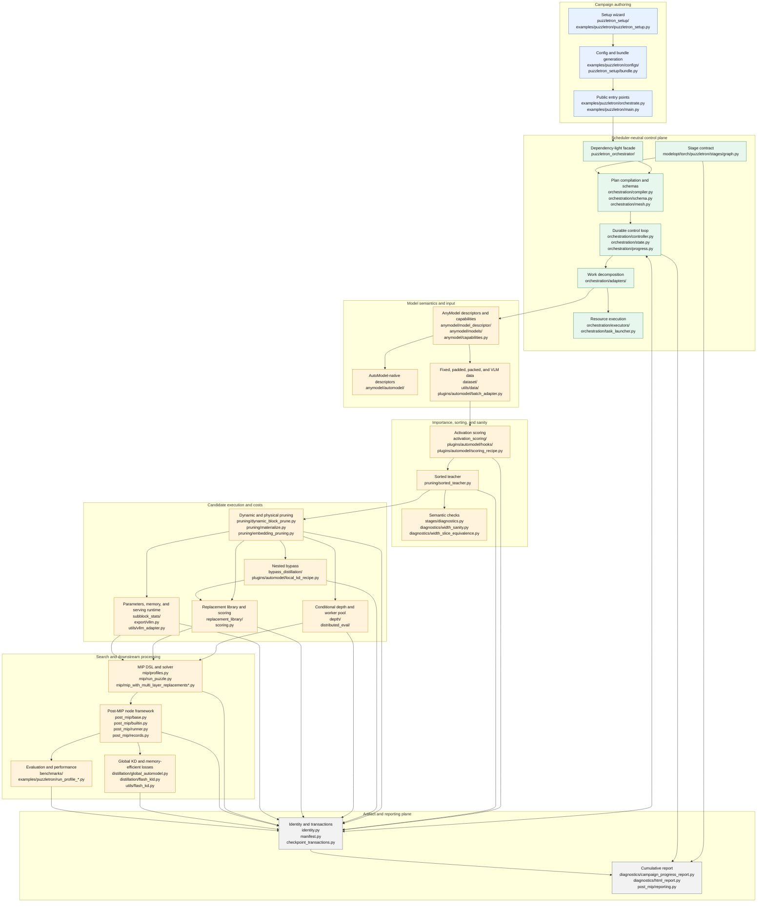

# Puzzletron v2 Architecture

> **Scope:** This document maps the Puzzletron v2 design to the current working
> branch as of July 23, 2026. The post-MIP node framework is implemented but
> still evolving; explicitly future work is separated near the end.

## Executive summary

Puzzletron v2 turns pruning from a sequence of model-specific scripts into a
distributed, validated, end-to-end campaign. The design is driven by three
goals:

1. **Scalability**, run large and long-context models with stage-specific
   tensor, context, pipeline, expert, data, and sequence parallelism; avoid
   repeatedly loading or materializing checkpoints; and distribute independent
   work through persistent or sharded workers.
2. **Semantic correctness**, describe every model and pruning axis explicitly,
   collect all compatible importance statistics together, and gate the campaign
   with sorting, ranking, slicing, bypass, and distillation checks.
3. **End-to-end automation**, generate a campaign from a setup wizard, execute
   its dependency graph, search for architectures, run downstream processing,
   and continuously assemble a durable HTML report.

| Concern | Puzzletron v1 | Puzzletron v2 |
|---|---|---|
| Model execution | Hugging Face plus naive pipeline parallelism | AutoModel recipes with stage-specific `TP`, `CP`, `PP`, `EP`, `DP/FSDP/HSDP`, and sequence parallelism |
| Inputs | Fixed-size text samples | Fixed, padded, or packed text and multimodal batches with valid-token/media semantics |
| Width analysis | Primarily FFN width, often one pass per axis | Descriptor-owned hooks for multiple layer types and axes, collected in combined passes |
| Checkpoints | Conversion copies/splits weights; many candidate checkpoints | Conversion links weights; the teacher is sorted once; most candidates are sliced dynamically |
| Bypass | One training run per layer configuration | Nested/Matryoshka sampling across the search space with block or subblock granularity |
| Depth | Search tends to retain no-op choices | Conditional, iterative depth ranking followed by separate MIP scenarios |
| Execution | Stage-specific launch scripts | One scheduler-neutral DAG controller over Slurm, SSH bare metal, or local execution |
| After MIP | Separate manual workflow | Configurable post-MIP node graph for filtering, materialization, evaluation, AIPerf, and global KD |
| Validation | Stage-local checks | Campaign-wide semantic gates with durable manifests and visible warnings/failures |
| Reporting | Results assembled after the fact | A cumulative HTML report regenerated from canonical artifacts throughout the campaign |

## 1. Component diagram

This view separates the lightweight control plane from GPU-heavy model work.
The experiment YAML owns algorithm semantics, the runner YAML owns the
environment, and the execution YAML owns placement and failure policy. The
orchestrator binds those contracts without importing the model runtime on a
login node.

### Key design decisions

- **One sorted teacher, many logical candidates.** Activation hooks rank every
  supported axis, then Puzzletron permutes the teacher once so each prefix is a
  valid candidate. Dynamic slicing or masking supports fast experiments, while
  physical materialization remains the correctness ground truth.
- **Parallelism belongs to the stage.** Width collection is one coordinated
  distributed model; depth uses multiple persistent model instances; vLLM
  statistics use independent sharded instances. `EP` overlays the FSDP shard
  axis rather than multiplying the GPU allocation.
- **Granularity is explicit.** Bypass, replacement scoring, vLLM statistics,
  and depth decisions can operate at block or subblock granularity.
- **Correctness and quality are separate.** Sort and slice equivalence are
  correctness gates. Ranking against reverse and unsorted/random controls is a
  quality check whose warning remains visible.
- **Artifacts are APIs.** Stages communicate through versioned, hashed,
  transactionally published artifacts rather than in-memory coupling. This
  enables resume, parallel execution, and report regeneration.

## 2. Code structure mapped to the component diagram

The following diagram preserves the component boundaries above while replacing
each conceptual name with its primary implementation locations. Paths are
relative to the repository root.

### Component-to-code map

| Component | Primary code | Responsibility |
|---|---|---|
| Setup and campaign contracts | `puzzletron_setup/`, `examples/puzzletron/configs/` | Inspect model capabilities, ask relevant questions, and emit validated smoke/production experiment, runner, and execution bundles |
| Stage contract | `modelopt/torch/puzzletron/stages/graph.py` | Define canonical stages, dependencies, completion artifacts, enablement, and distributed behavior |
| Orchestrator | `modelopt/torch/puzzletron/orchestration/` exposed through `puzzletron_orchestrator/` | Compile the DAG, validate meshes, pack instances, execute work, persist state, retry, resume, and monitor |
| Model abstraction | `modelopt/torch/puzzletron/anymodel/` | Describe model structure, supported axes, tensor bindings, export behavior, and HF versus AutoModel-native implementations |
| AutoModel integration | `modelopt/torch/puzzletron/plugins/automodel/` | Implement distributed forward, hook collection, dynamic candidate execution, local bypass/KD, solution scoring, and stage-specific recipes |
| Input layer | `modelopt/torch/puzzletron/dataset/`, `modelopt/torch/puzzletron/utils/data/` | Preserve fixed/padded/packed boundaries, valid tokens, multimodal inputs, and distributed sampling semantics |
| Width ranking and sorting | `activation_scoring/`, `pruning/sorted_teacher.py` | Collect multi-axis statistics and permute coupled tensors into importance order |
| Pruning and materialization | `pruning/` | Apply reversible dynamic slicing and create physically pruned checkpoints for export and correctness checks |
| Nested bypass | `bypass_distillation/` | Sample configurations, train nested candidates, checkpoint durably, and record per-architecture observations |
| Depth ranking | `depth/`, `distributed_eval/` | Iteratively score cumulative removals with a coordinator and persistent worker pool |
| Candidate quality | `replacement_library/`, `scoring.py` | Build valid replacement choices and estimate local quality impact at block or subblock granularity |
| Cost estimation | `subblock_stats/`, `export/vllm.py`, `utils/vllm_adapter.py` | Measure parameter, memory, and exact serving-runtime costs across widths and workloads |
| MIP search | `mip/` | Compile named profiles, constraints, objectives, depth selections, and homogeneous/heterogeneous solutions |
| Post-MIP | `post_mip/` | Execute typed filtering, materialization, evaluation, AIPerf, and global-KD nodes with candidate lineage |
| Global KD | `distillation/` | Run AutoModel teacher/student training, including online-softmax KLD/CE and MTP-aware loss terms |
| Artifacts and report | `identity.py`, `manifest.py`, `checkpoint_transactions.py`, `diagnostics/` | Publish resumable state and render the cumulative campaign report from canonical evidence |

## 3. Campaign DAG

The canonical graph exposes parallelism without changing algorithm semantics.
For example, vLLM statistics can start after conversion while depth and width
importance start after tokenization. MIP waits until quality, cost, and depth
evidence are all available.

```mermaid
flowchart LR
    convert["Convert checkpoint<br/>link teacher weights"]
    tokenize["Tokenize / pack data"]
    vllm["vLLM runtime statistics"]
    depth["Iterative conditional<br/>depth importance"]
    width["Multi-axis width<br/>importance hooks"]
    sort["Sort teacher once"]
    sortcheck["Sort equivalence"]
    widthcheck["Ranking quality<br/>sorted vs reverse vs unsorted"]
    slicecheck["Dynamic vs physical<br/>slicing equivalence"]
    bypasscheck["Bypass overfit checks"]
    bypass["Nested bypass"]
    library["Build candidate /<br/>replacement library"]
    replace["Replacement scoring"]
    mip["MIP profiles<br/>quality + cost + depth constraints"]

    subgraph after["Post-MIP candidate graph"]
        select["Filter / Pareto selection"]
        materialize["Physical materialization"]
        eval["Zero-shot / downstream evaluation"]
        perf["AIPerf"]
        kdcheck["Global KD overfit check"]
        kd["Global KD"]
        posteval["Post-KD evaluation"]
    end

    report["Cumulative campaign report"]

    convert --> tokenize
    convert --> vllm
    tokenize --> depth
    tokenize --> width
    width --> sort
    sort --> sortcheck --> widthcheck --> slicecheck
    sort --> bypasscheck --> bypass
    bypass --> library
    vllm --> library
    library --> replace
    vllm --> mip
    depth --> mip
    replace --> mip

    mip --> select
    select --> materialize
    materialize --> eval
    materialize --> perf
    materialize --> kdcheck --> kd --> posteval

    convert -.-> report
    widthcheck -.-> report
    slicecheck -.-> report
    bypass -.-> report
    depth -.-> report
    vllm -.-> report
    mip -.-> report
    eval -.-> report
    perf -.-> report
    kd -.-> report
    posteval -.-> report

    classDef required fill:#fff3dc,stroke:#c98716,color:#111;
    classDef gate fill:#fde9e7,stroke:#c94c4c,color:#111;
    classDef downstream fill:#e8f7ee,stroke:#2e8b57,color:#111;
    classDef reportStyle fill:#f2f2f2,stroke:#666,color:#111;

    class convert,tokenize,vllm,depth,width,sort,bypass,library,replace,mip required;
    class sortcheck,widthcheck,slicecheck,bypasscheck,kdcheck gate;
    class select,materialize,eval,perf,kd,posteval downstream;
    class report reportStyle;
```

Solid arrows are execution dependencies. Dotted arrows are incremental report
updates. Post-MIP nodes are campaign-configurable: they may branch, refer to
metrics from earlier nodes, select an earlier model revision, and include a
durable manual decision gate.

## Semantic validation gates

| Gate | Question answered | Outcome |
|---|---|---|
| Capability validation | Does the model support every requested axis, backend, and parallel mode? | Invalid campaign configuration fails before expensive work |
| Sort sanity | Does full-width sorting or reverse sorting preserve teacher behavior? | Difference beyond dtype-aware tolerance is a correctness failure |
| Width sanity | Does the proposed ranking outperform reverse and unsorted/random controls at reduced width? | Poor ranking is a quality finding; warning policy determines whether it also fails the stage |
| Slicing sanity | Does dynamic slicing agree with physical materialization? | Disagreement is a correctness failure |
| Bypass sanity | Can a fixed small candidate and a sampled nested search overfit one batch? | Validates boundaries, gradients, and sampling mechanics |
| Depth evaluation | Are removal scores recomputed after every selected removal? | Produces a conditional trajectory rather than independent linear scores |
| Global KD sanity | Can the student overfit with the configured CE/KLD/MTP loss path? | Validates forward/backward and loss semantics before a long run |
| Artifact completion | Are all expected identities, shards, candidates, and outputs present? | Partial work remains resumable progress, not a completed stage |

These gates answer different questions. Width ranking compares the quality of
different reduced candidates at the same target geometry. Sort and slicing
equivalence compare routes that are supposed to represent the same model
operation. A poor ranking can show that the importance heuristic is not useful
for a case even when every candidate is structurally valid. An equivalence
failure shows that a permutation or runtime slice does not reproduce its
reference implementation, so later measurements cannot be trusted as evidence
for the physical checkpoint.

The implementation has two stage-completion policies. Correctness failures
always fail their stage. Ranking-quality findings remain warnings by default
and fail the stage when `sanity.fail_on_warnings` is enabled. Scientific,
customer, or release qualification is a third layer and is not currently a
separate Puzzletron verdict. A qualification plan must declare its required
controls, metrics, sample count, tolerances, axis and target coverage, and
aggregation rule. It may reject a campaign for a ranking-quality warning
without reclassifying that warning as a correctness error. The
[sanity validation guide](sanity_validation.md) provides definitions, the
slicing mental model, and a worked example.

## Current implementation versus design direction

### Implemented in the current v2 code

- A canonical stage registry and dependency graph.
- A dependency-light setup wizard that emits smoke and production bundles.
- A scheduler-neutral orchestrator with `single`, `sharded`, and
  `persistent_pool` execution strategies.
- Slurm, SSH bare-metal, and local executors.
- AutoModel-backed recipes for activation scoring, candidate scoring, bypass,
  evaluation, and global KD.
- Descriptor-owned pruning capabilities, multi-axis hooks, sorted teachers,
  dynamic slicing, and physical materialization.
- Conditional depth evaluation with persistent distributed workers.
- Named MIP profiles and typed post-MIP nodes for filtering, materialization,
  evaluation, AIPerf, and global KD.
- Durable identity, manifest, transaction, resume, lineage, and cumulative
  reporting infrastructure.

### Deliberate next-step convergence

- Make every pre- and post-MIP operation use one uniform node interface with
  dependencies, parallelization policy, artifact contracts, and
  `generate_partial_report()` behavior.
- Generate report-only work on the control plane instead of consuming GPU
  allocations.
- Expand post-MIP nodes to RL and speculative-decoding workflows such as EAGLE
  or DFlash when their contracts are stable.
- Improve embedding-width search so ranking, replacement scoring, and bypass do
  not require a full independent sweep for every embedding size.
- Systematically exercise valid parallelism, input-layout, and modality
  combinations for every supported model.

## Manager takeaway

Puzzletron v2 is not only a larger set of pruning algorithms. It is an
architecture for running pruning as a reproducible distributed campaign:

- **AutoModel and persistent workers provide scale.**
- **Descriptors, physical materialization, and sanity gates provide semantic
  confidence.**
- **The DAG, artifact contracts, post-MIP nodes, and cumulative report provide
  end-to-end automation.**

The remaining architectural opportunity is consolidation: represent all work
as typed nodes so the orchestrator, artifact system, and report generator share
one extensible contract from setup through final model selection.
