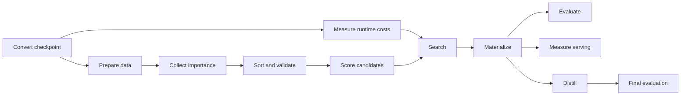

# Puzzletron architecture

Puzzletron separates a dependency-light controller from GPU-heavy model work.
A recipe and site file select a maintained route. The resolver validates and
seals the full configuration, then the orchestrator compiles and executes a
resumable stage graph.

Architecture support does not by itself establish that a model, pruning axis,
or topology has been validated end to end. See the [campaign report
catalog](campaign_reports.md) for recorded runs and their evidence status.

## Components

| Component | Primary code | Responsibility |
|---|---|---|
| Public command | `examples/puzzletron/puzzletron.py` | Validate, explain, launch, resume, and inspect maintained recipes |
| Configuration | `modelopt/torch/puzzletron/orchestration/public_config.py` | Resolve recipe and site inputs and seal immutable run bundles |
| Stage graph | `modelopt/torch/puzzletron/stages/graph.py` | Define dependencies, enablement, and completion artifacts |
| Orchestrator | `modelopt/torch/puzzletron/orchestration/` | Compile resources, execute work, persist state, and recover |
| Model semantics | `modelopt/torch/puzzletron/anymodel/` | Describe model structure, supported axes, and tensor bindings |
| AutoModel integration | `modelopt/torch/puzzletron/plugins/automodel/` | Run distributed scoring, pruning, bypass, evaluation, and KD |
| Search and downstream work | `modelopt/torch/puzzletron/mip/` and `post_mip/` | Select candidates, materialize, evaluate, benchmark, and distill |
| Evidence | `identity.py`, `manifest.py`, `checkpoint_transactions.py`, and `diagnostics/` | Publish resumable artifacts and cumulative reports |

The compatibility command `orchestrate.py` consumes existing experiment,
runner, and execution files. Maintained recipes reach the same orchestrator
through sealed generated inputs.

## Campaign graph

Routes enable a subset of this graph and may configure their post-MIP nodes
differently:

Stages communicate through versioned, hashed artifacts rather than shared
in-memory state. This permits retries, parallel execution, resume, and report
regeneration. The compiler validates each stage's tensor, pipeline, context,
data, and expert parallel dimensions plus its number of independent instances.

## Validation gates

| Gate | What it checks |
|---|---|
| Capability | The model supports every requested axis, backend, and parallel mode |
| Sort sanity | Full-width sorting preserves teacher behavior |
| Width sanity | A reduced-width ranking is compared with original and reverse controls |
| Slice equivalence | Dynamic slicing matches physical materialization |
| Bypass sanity | Nested candidates, gradients, and sampling work on a bounded batch |
| Depth evaluation | Removal scores are recomputed after each selected removal |
| Distillation sanity | The configured student and loss path can train on a bounded batch |
| Artifact completion | Expected identities, shards, candidates, and outputs are complete |

Correctness failures fail their stage. Ranking-quality findings are warnings by
default and may be configured to fail. Neither result is a release or model
quality verdict. A qualification decision must define its own controls,
metrics, sample counts, tolerances, and aggregation rule. See [sanity
validation](sanity_validation.md) for the detailed checks.

## Execution properties

- Puzzletron sorts a teacher once so prefix slicing can represent many logical
  candidates; physical materialization remains the checkpoint ground truth.
- Parallelism belongs to each stage. Independent instances multiply a stage's
  resource request; expert parallelism overlays the sharded data-parallel
  dimension.
- Slurm, SSH-managed bare metal, and local execution share the same compiled
  plan contract.
- The controller treats partial work as resumable progress and binds completed
  work to artifact identity rather than filenames alone.
