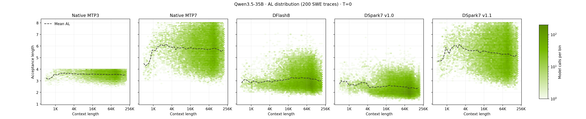

# Qwen3.5 DSpark

This guide provides complete, reproducible steps to train DSpark drafters for Qwen3.5-9B and Qwen3.5-35B-A3B. See the [Qwen3-8B walkthrough](../QWEN3_8B_DSPARK_WALKTHROUGH.md) for the training mechanics.

Hyperparameters used in this guide:

| Parameter       |                               Qwen3.5-9B |              Qwen3.5-35B-A3B |        35B SWE fine-tuning |
|-----------------|-----------------------------------------:|-----------------------------:|---------------------------:|
| Input           |                   Nemotron PT v2 prompts |       Nemotron PT v2 prompts |               Agent traces |
| Synthesis       | 192 shards · mixed thinking/non-thinking |   384 shards · thinking only |                       none |
| Training Nodes  |               8 target + 8 trainer nodes | 16 target + 16 trainer nodes | 8 target + 8 trainer nodes |
| Sequence length |                                       4K |                           4K |                        32K |
| Block size      |                                        8 |                            8 |                          8 |
| Anchors         |                                      512 |                          512 |                       4096 |
| Draft layers    |                     6 layers · FFN 12288 |          6 layers · FFN 6144 |           same as 35B base |
| Captures        |                   `[2,8,13,19,24,30,32]` |       `[2,9,16,24,31,38,40]` |           same as 35B base |
| Attention       |                                 SWA 4096 |                     SWA 4096 |           same as 35B base |
| Learning rate   |                     6e-4 → 3e-5 · cosine |         6e-4 → 3e-5 · cosine |       1e-4 → 3e-5 · cosine |
| Global batch    |                                      512 |                          512 |                        256 |
| Epochs          |                                        5 |                            5 |                         ~5 |

## 1. Setup

Requirements: a Slurm cluster and an `HF_TOKEN` with access to [Nemotron Post-Training Dataset v2](https://huggingface.co/datasets/nvidia/Nemotron-Post-Training-Dataset-v2). Dataset synthesis and training use the `vllm/vllm-openai:v0.27.1` container. Benchmarks use `vllm/vllm-openai:nightly` with Model Runner V2.

The workflow uses one shared root for the Model-Optimizer checkout, caches, and job outputs:

```text
dspark-training/
├── Model-Optimizer/
├── .cache/
└── outputs/nemorun/experiments/cicd/
```

```bash
# Set the DSpark training root
export DSPARK_TRAINING_ROOT="/path/to/dspark-training"
mkdir -p "$DSPARK_TRAINING_ROOT"
cd "$DSPARK_TRAINING_ROOT"

# Set the Slurm account and partition
export SLURM_ACCOUNT="<account>"
export SLURM_PARTITION="<partition>"

# Set the Hugging Face and W&B credentials
export HF_TOKEN="<hf-token>"
export WANDB_API_KEY="<wandb-api-key>"
: "${HF_TOKEN:?Export HF_TOKEN before continuing}"
: "${WANDB_API_KEY:?Export WANDB_API_KEY before continuing}"

# Clone Model-Optimizer and check out a specific branch when needed
git clone --recurse-submodules https://github.com/NVIDIA/Model-Optimizer.git

# Set the cache and output directories
export SLURM_HOST="localhost"
export SLURM_HF_LOCAL="$DSPARK_TRAINING_ROOT/.cache/hf"
export UV_CACHE_DIR="$DSPARK_TRAINING_ROOT/.cache/uv"
export NEMORUN_HOME="$DSPARK_TRAINING_ROOT/outputs/nemorun"
export SLURM_JOB_DIR="$NEMORUN_HOME/experiments"
mkdir -p "$SLURM_HF_LOCAL" "$SLURM_JOB_DIR" "$NEMORUN_HOME" "$UV_CACHE_DIR"

# Enter the launcher directory, install uv, and sync dependencies
cd "$DSPARK_TRAINING_ROOT/Model-Optimizer/tools/launcher"
command -v uv >/dev/null || curl -LsSf https://astral.sh/uv/install.sh | sh
export PATH="$HOME/.local/bin:$PATH"
uv sync
```

Download HF models and dataset:

```bash
# Download Qwen3.5-9B and DFlash drafters
uv run --with huggingface-hub hf download Qwen/Qwen3.5-9B --revision c202236235762e1c871ad0ccb60c8ee5ba337b9a --local-dir "$SLURM_HF_LOCAL/Qwen/Qwen3.5-9B"
uv run --with huggingface-hub hf download z-lab/Qwen3.5-9B-DFlash --revision 5fc3b3d474760f18c516db87d84c37edbfd3ede6 --local-dir "$SLURM_HF_LOCAL/z-lab/Qwen3.5-9B-DFlash"
# Download Qwen3.5-35B-A3B and DFlash drafters
uv run --with huggingface-hub hf download Qwen/Qwen3.5-35B-A3B --revision 59d61f3ce65a6d9863b86d2e96597125219dc754 --local-dir "$SLURM_HF_LOCAL/Qwen/Qwen3.5-35B-A3B"
uv run --with huggingface-hub hf download z-lab/Qwen3.5-35B-A3B-DFlash --revision 52cb554b4995dede3e2e1bdb129cdb1f3529332b --local-dir "$SLURM_HF_LOCAL/z-lab/Qwen3.5-35B-A3B-DFlash"

# Prepare the synthesis prompts from Nemotron Post-Training Dataset v2
HF_HOME="$SLURM_HF_LOCAL" uv run --with datasets python ../../examples/dataset/make_nemotron_ptv2_dataset.py --mode generate --output-dir "$SLURM_HF_LOCAL/nvidia/Nemotron-Post-Training-Dataset-v2"
```

## 2. Qwen3.5-9B

### 2.a Dataset synthesis

Synthesize the dataset with the target model using prompts from Nemotron Post-Training Dataset v2.

```bash
# Run the two-shard synthesis pipeclean
uv run launch.py --yaml examples/Qwen/Qwen3.5-9B/hf_synth.yaml pipeline.global_vars.output_dir=/hf-local/modelopt/qwen3.5-9b-dspark-pipeclean pipeline.task_0.slurm_config.array=0-1 --yes

# Synthesize the full dataset (192 shards, one Slurm job per shard)
uv run launch.py --yaml examples/Qwen/Qwen3.5-9B/hf_synth.yaml --yes
```

Each completed shard writes a non-empty `shard_<id>.jsonl` in `$DSPARK_TRAINING_ROOT/.cache/hf/modelopt/qwen3.5-9b-dspark-synthesis/`.

### 2.b Drafter training

Run a two-node pipeclean on the synthesized dataset before full training. A repeated full-training submission resumes the latest checkpoint and `singleton` serializes submissions.

```bash
# Run pipeclean training (2 nodes)
# Run two optimizer steps, then cancel it
WANDB_MODE=disabled SERVE_NODES=1 uv run launch.py --yaml examples/Qwen/Qwen3.5-9B/hf_streaming_dspark_multi_node.yaml pipeline.global_vars.output_dir=/cicd/qwen3.5-9b-dspark-pipeclean pipeline.task_1.slurm_config.nodes=2 pipeline.task_2.skip=true --yes

# Run or resume production training (16 nodes)
uv run launch.py --yaml examples/Qwen/Qwen3.5-9B/hf_streaming_dspark_multi_node.yaml pipeline.task_2.skip=true --yes

# Export and validate the trained drafter (T=0 and T=1 serving smoke tests)
uv run launch.py --yaml examples/Qwen/Qwen3.5-9B/hf_streaming_dspark_multi_node.yaml pipeline.task_1.skip=true --yes
```

Checkpoints and the serving export are written to `$DSPARK_TRAINING_ROOT/outputs/nemorun/experiments/cicd/qwen3.5-9b-dspark/{training,export}`.

### 2.c Benchmark

Each benchmark runs Base, DSpark7, MTP3, MTP7, and DFlash8 at T=0 and T=1 on vLLM Model Runner V2.

```bash
# Benchmark concurrency 1
uv run launch.py --yaml examples/Qwen/Qwen3.5-9B/specdec_bench_tp1_c1.yaml --yes

# Benchmark concurrency 32
uv run launch.py --yaml examples/Qwen/Qwen3.5-9B/specdec_bench_tp1_c32.yaml --yes
```

Results are written under `$DSPARK_TRAINING_ROOT/outputs/nemorun/experiments/cicd/` in the `qwen3.5-9b-dspark-benchmark-tp1-c1/` and `qwen3.5-9b-dspark-benchmark-tp1-c32/` directories.

Qwen3.5-9B DSpark7 acceptance length on SPEED-Bench:

| Category | DSpark7 (T1) | DSpark7 (T0) |
| :---- | :---- | :---- |
| Coding | 4.3773 | 4.8827 |
| Humanities | 3.1494 | 3.8773 |
| Math | 4.1374 | 4.6412 |
| Multilingual | 3.8842 | 4.3879 |
| QA | 3.2359 | 4.0704 |
| RAG | 4.1099 | 4.5759 |
| Reasoning | 3.7000 | 4.1205 |
| Roleplay | 2.6752 | 3.8322 |
| STEM | 3.3827 | 3.9522 |
| Summarization | 3.6285 | 4.2045 |
| Writing | 2.8436 | 3.1263 |
| Overall AL | 3.5567 | 4.1519 |

## 3. Qwen3.5-35B-A3B

### 3.a Dataset synthesis

Synthesize the dataset with the target model using prompts from Nemotron Post-Training Dataset v2.

```bash
# Run the one-shard synthesis pipeclean
uv run launch.py --yaml examples/Qwen/Qwen3.5-35B-A3B/hf_synth.yaml pipeline.global_vars.output_dir=/hf-local/modelopt/qwen3.5-35b-a3b-dspark-pipeclean pipeline.task_0.slurm_config.array=0-0 --yes

# Synthesize the full dataset (384 shards, one Slurm job per shard)
uv run launch.py --yaml examples/Qwen/Qwen3.5-35B-A3B/hf_synth.yaml --yes
```

Each completed shard writes a non-empty `shard_<id>.jsonl` in `$DSPARK_TRAINING_ROOT/.cache/hf/modelopt/qwen3.5-35b-a3b-dspark-synthesis/`.

### 3.b Drafter training

The 35B recipe uses 16 target-server nodes and 16 trainer nodes.

```bash
# Run pipeclean training (2 nodes)
# Run two optimizer steps, then cancel it
WANDB_MODE=disabled SERVE_NODES=1 uv run launch.py --yaml examples/Qwen/Qwen3.5-35B-A3B/hf_streaming_dspark_multi_node.yaml pipeline.global_vars.output_dir=/cicd/qwen3.5-35b-a3b-dspark-pipeclean pipeline.task_1.slurm_config.nodes=2 pipeline.task_2.skip=true --yes

# Run or resume production training (32 nodes)
uv run launch.py --yaml examples/Qwen/Qwen3.5-35B-A3B/hf_streaming_dspark_multi_node.yaml pipeline.task_2.skip=true --yes

# Export and validate the trained drafter (T=0 and T=1 serving smoke tests)
uv run launch.py --yaml examples/Qwen/Qwen3.5-35B-A3B/hf_streaming_dspark_multi_node.yaml pipeline.task_1.skip=true --yes
```

Checkpoints and the serving export are written to `$DSPARK_TRAINING_ROOT/outputs/nemorun/experiments/cicd/qwen3.5-35b-a3b-dspark/{training,export}`.

### 3.c Benchmark

Each benchmark runs Base, DSpark7, MTP3, MTP7, and DFlash8 at T=0 and T=1 on vLLM Model Runner V2.

```bash
# Benchmark concurrency 1
uv run launch.py --yaml examples/Qwen/Qwen3.5-35B-A3B/specdec_bench_tp2_c1.yaml --yes

# Benchmark concurrency 32
uv run launch.py --yaml examples/Qwen/Qwen3.5-35B-A3B/specdec_bench_tp2_c32.yaml --yes
```

Results are written under `$DSPARK_TRAINING_ROOT/outputs/nemorun/experiments/cicd/` in the `qwen3.5-35b-a3b-dspark-benchmark-tp2-c1/` and `qwen3.5-35b-a3b-dspark-benchmark-tp2-c32/` directories.

Qwen3.5-35B-A3B DSpark7 acceptance length on SPEED-Bench:

| Category | DSpark7 (T1) | DSpark7 (T0) |
| :---- | :---- | :---- |
| Coding | 4.3720 | 4.8880 |
| Humanities | 3.0543 | 3.6332 |
| Math | 4.0852 | 4.5721 |
| Multilingual | 3.7786 | 4.1805 |
| QA | 3.2111 | 3.7132 |
| RAG | 4.0790 | 4.4432 |
| Reasoning | 3.6061 | 3.9967 |
| Roleplay | 2.5711 | 3.3469 |
| STEM | 3.3168 | 3.8496 |
| Summarization | 3.5660 | 4.0488 |
| Writing | 2.7125 | 2.9998 |
| Overall AL | 3.4866 | 3.9702 |

### 3.d Optional SWE fine-tuning

Use fine-tuning to improve acceptance length (AL) for specific domains, such as SWE and long-context workloads.

Prepare fine-tuning data:

1. Prepare rollout traces from the target domain. SWE traces can come from evaluation or RL rollouts.
2. Convert each conversation into one JSONL record using the following schema:

   ```json
   {"conversation_id":"...","messages":[...],"token_ids":[...],"loss_mask":[0,1,...]}
   ```

   If the trace contains recorded target token IDs and an assistant loss mask, preserve them to skip additional tokenization and masking (RL traces may already contain these values, and `loss_mask=1` marks assistant tokens). Otherwise, provide `messages`, and the training loader will tokenize them and derive the loss mask. It is not necessary to truncate the sequence length during conversion because the loader automatically truncates tokens and masks together to the configured sequence length.

   See [prepare-swe-data.py](../../../tools/launcher/examples/Qwen/Qwen3.5-35B-A3B/prepare-swe-data.py) for a Prime-RL trace conversion example.

3. Store the JSONL records under `$DSPARK_TRAINING_ROOT/.cache/hf/modelopt/qwen3.5-35b-a3b-dspark-finetuning/`.

Run DSpark fine-tuning:

Set `DRAFT_CHECKPOINT` to a completed checkpoint from 3.b. The first fine-tuning run loads its model weights without the optimizer state. Repeated submissions resume the latest fine-tuning checkpoint.

```bash
export DRAFT_CHECKPOINT="/cicd/qwen3.5-35b-a3b-dspark/training/checkpoint-<step>"
```

```bash
# Run pipeclean training (2 nodes)
# Run two optimizer steps, then cancel it
WANDB_MODE=disabled SERVE_NODES=1 uv run launch.py --yaml examples/Qwen/Qwen3.5-35B-A3B/hf_streaming_dspark_finetuning_multi_node.yaml pipeline.global_vars.draft_model="$DRAFT_CHECKPOINT" pipeline.global_vars.output_dir=/cicd/qwen3.5-35b-a3b-dspark-finetuning-pipeclean pipeline.task_1.slurm_config.nodes=2 pipeline.task_2.skip=true --yes

# Run or resume production training (16 nodes)
uv run launch.py --yaml examples/Qwen/Qwen3.5-35B-A3B/hf_streaming_dspark_finetuning_multi_node.yaml pipeline.global_vars.draft_model="$DRAFT_CHECKPOINT" pipeline.task_2.skip=true --yes

# Export and validate the trained drafter (T=0 and T=1 serving smoke tests)
uv run launch.py --yaml examples/Qwen/Qwen3.5-35B-A3B/hf_streaming_dspark_finetuning_multi_node.yaml pipeline.task_1.skip=true --yes
```

Checkpoints and the serving export are written to `$DSPARK_TRAINING_ROOT/outputs/nemorun/experiments/cicd/qwen3.5-35b-a3b-dspark-finetuning/{training,export}`.

### 3.e Benchmark

Benchmark the fine-tuned drafter on domain data, such as long-context SWE traces, by replaying each turn's model-call prompt. Plot AL against context length for the original and fine-tuned drafters under matched serving and sampling settings. （Long context benchmark requires the DSpark hybrid prefix-cache fix in [`jinzex/vllm:jinzex/dspark`](https://github.com/jinzex/vllm/tree/jinzex/dspark)）.

SWE fine-tuning improved DSpark7 acceptance length across all measured context lengths.


