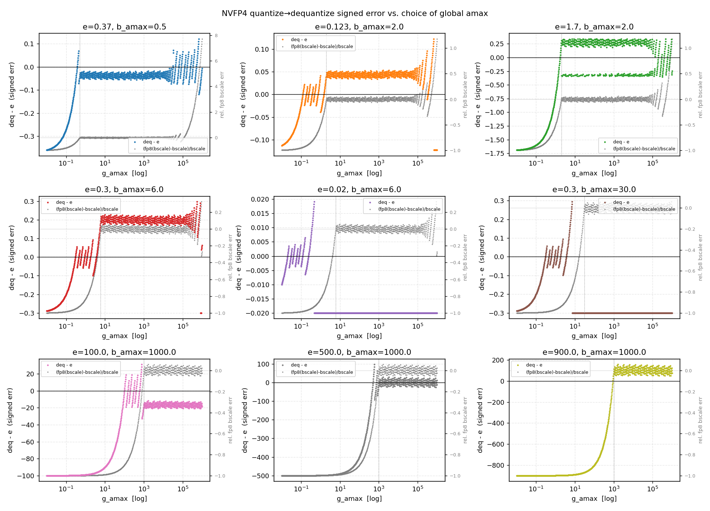
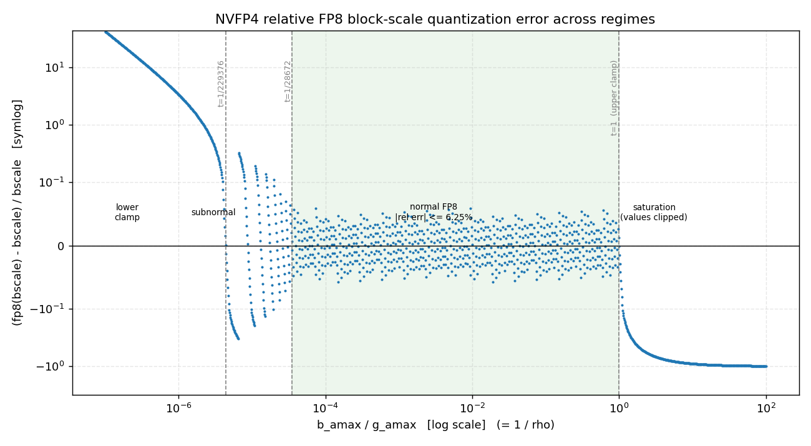

# NVFP4 Global-Scale (g_amax) Study

A self-contained numerical study of how the **per-tensor global scale** in NVFP4
affects quantization error, and how to **calibrate it** — especially for
activations, where calibration data may not cover the true inference dynamic
range.

Everything here is reproduced by [`nvfp4_global_scale_study.py`](./nvfp4_global_scale_study.py),
which drives the **real** `modelopt.torch.quantization.qtensor.nvfp4_tensor.NVFP4QTensor`
quantize/dequantize path (not a re-implementation) and cross-checks it against
the closed-form math.

```bash
python nvfp4_global_scale_study.py
```

## TL;DR

- NVFP4 uses two-level scaling: a per-tensor `global_scale` (set by a global
  amax `g_amax`) and a per-16-element FP8-E4M3 `block_scale` (set by each
  block's amax `b_amax`).
- `g_amax` does **not** set element resolution — the per-block scale already
  normalizes every block to the e2m1 range `[-6, 6]`. `g_amax` only decides
  **where each block's FP8 scale lands in the FP8 range**, i.e. which blocks
  fall out of the well-conditioned "normal FP8" zone.
- Therefore choosing `g_amax` is a **range-only, second-order** decision with a
  closed-form feasible window. Pick `g_amax` anywhere in `[B_max, 28672·B_min]`
  and you are essentially optimal.

## 1. The math (verified)

For an element `e` in a block with block-amax `b_amax`, in a tensor with global
amax `g_amax`:

```text
global_scale = g_amax / (6 · 448)
block_scale  = fp8_e4m3( b_amax / (6 · global_scale) )            # = fp8(b_amax · 448 / g_amax)
             clamped to the FP8-E4M3 range [2^-9, 448]
deq(e)       = snap_e2m1( e / (block_scale · global_scale) ) · (block_scale · global_scale)
```

The product collapses to a clean value when the block scale is neither clamped
nor (heavily) FP8-rounded:

```text
block_scale · global_scale  ->  b_amax / 6
```

so `scaled = e / (b_amax/6) = 6e/b_amax`, mapping the block's largest-magnitude
element onto the e2m1 max value `6`.

`nvfp4_global_scale_study.py` **Part 1** asserts this against the live code over
15 scenarios (`ALL real==manual: True`).

## 2. Error vs. g_amax — three regimes



Each panel locks `(e, b_amax)` and sweeps `g_amax` from `1e-2` to `1e6`.
Colored points = signed element error `deq - e` (left axis); gray points =
**relative** FP8 block-scale error `(fp8(x) - x)/x`, `x = b_amax·448/g_amax`
(right axis). Dotted vertical = the natural single-block choice `g_amax = b_amax`.

| Regime | Condition (`ρ = g_amax / b_amax`) | Block-scale `x` | What happens |
|---|---|---|---|
| **1. Saturation** | `ρ < 1` | `x > 448` → upper clamp | block's large values get clipped — **large error** |
| **2. Well-conditioned** | `1 ≤ ρ ≤ 28672` | normal FP8 | error is **flat** = e2m1 grid floor + bounded ±6.25% FP8 wobble |
| **3a. Subnormal** | `28672 < ρ ≤ 229376` | subnormal FP8 | block-scale precision degrades, error grows |
| **3b. Underflow** | `ρ > 229376` | `x < 2^-9` → lower clamp | block scale floors, element re-zeroed — **catastrophic** |

Key subtlety the plot makes concrete: the gray *absolute* FP8 error → 0 at large
`g_amax` only because the scale magnitude shrinks; the **relative** FP8 error
(what actually perturbs the result) stays bounded by the E4M3 mantissa step
(`2^-4 = 6.25%` worst case) and only hits exactly 0 at discrete `g_amax` where
`b_amax·448/g_amax` is an exact E4M3 value. Those exact points are where
`deq - e` touches its grid floor.

### The "fixed zone" boundaries (regime 2)

The well-conditioned band is where the block scale stays in **normal FP8**
(`2^-6 ≤ x ≤ 448`). Solving for `g_amax`:

```text
B_max  ≤  g_amax  ≤  28672 · B_min
        ^                    ^
   x = 448 edge        x = 2^-6 edge   (28672 = 448 · 64 = 7 · 2^12)
```

- The window **width is always 28672× (≈4.46 decades)** in `g_amax`, regardless
  of `b_amax`.
- It simply **slides right proportionally to `b_amax`**. This is exactly why, in
  the figure, larger-`b_amax` panels have their plateau shifted right.
- Below it, subnormal starts at `28672·B_min` and the lower clamp at
  `229376·B_min` (`= 448·512 = 7·2^15`).

## 3. The regimes, in one curve: FP8 block-scale error vs. b_amax/g_amax



The ideal block scale is `bscale = b_amax·448/g_amax = 448·t` with
`t = b_amax/g_amax = 1/ρ`, so the **relative** FP8 quantization error of the
block scale, `(fp8(bscale) − bscale)/bscale`, depends **only on `t`** — a single
curve that exposes every regime at once (y-axis is symlog):

| Region (`t = b_amax/g_amax`) | `ρ = g_amax/b_amax` | Behaviour |
|---|---|---|
| `t > 1` | `ρ < 1` | **Saturation** — `bscale` clamps to `448`; rel err → `−1` as the true scale runs away above the clamp. The block's large values get clipped. |
| `1/28672 ≤ t ≤ 1` (shaded) | `1 ≤ ρ ≤ 28672` | **Normal FP8** — bounded relative error `≤ 6.25%` (the E4M3 mantissa step); touches 0 at exact E4M3 values. This is the well-conditioned zone. |
| `1/229376 ≤ t < 1/28672` | `28672 < ρ ≤ 229376` | **Subnormal** — the "fan" of widening FP8 steps; rel err grows. |
| `t < 1/229376` | `ρ > 229376` | **Lower clamp** — `bscale` floors at `2⁻⁹`; rel err → `+∞` (`+42×` at `t=1e-7`), block effectively zeroed. |

This is the per-tensor view of the same boundaries derived in §2: the shaded
band is exactly the `[B_max, 28672·B_min]` window mapped onto the block-amax
ratio. It makes the asymmetry used in calibration (§4) visually obvious —
saturation drives the error hard toward `−1` (catastrophic), while the
subnormal side degrades gracefully until the lower clamp.

### Aside: the e2m1 grid dead zone (independent of g_amax)

Separately from the scale, the **4-bit e2m1 grid** imposes a hard floor on
element error. With an ideal scale (`g_amax = b_amax`), an element sits at
`scaled = 6·(e/b_amax)`; the smallest nonzero e2m1 level is `0.5` (rounding
boundary `0.25`), so

```text
|e| < b_amax / 24   ->   rounds to 0   (the element is annihilated)
```

Per-block dynamic range is only ~24×: any element more than 24× smaller than its
block's max is lost — independent of `g_amax`. This is the core reason small
blocks (16) and outlier handling matter, and why `g_amax` calibration cannot
rescue small-`e`/large-`b_amax` loss.

## 4. Calibrating g_amax (activations)

Because the **per-block scale is recomputed dynamically at inference**, an unseen
activation pattern can only hurt through one scalar per block: the block amax
`b_i` relative to the static `g_amax`. You don't need calibration to cover the
full activation distribution — only the **range of block amaxes**.

For a fixed `g_amax`, a runtime block is safe (normal FP8) iff its amax falls in
a fixed 28672×-wide window:

```text
g_amax / 28672  ≤  b  ≤  g_amax
```

The two ways to fall out are **very asymmetric**:

| Failure | Trigger | Severity |
|---|---|---|
| **Saturation** | `b > g_amax` (block bigger than expected) | catastrophic — clips the largest/outlier activations |
| **Subnormal/underflow** | `b < g_amax/28672` | graceful — small blocks, small absolute error |

So **bias `g_amax` high**: spend most of the 28672× budget as upward headroom.

### Recipe

1. From calibration, collect the per-block (16-wide) amax distribution and take
   robust statistics — not a single-batch max:
   - `B_max` = high percentile / EMA running max (e.g. 99.99th).
   - `B_min` = low percentile of blocks you care to represent (e.g. 1st);
     near-zero blocks are fine — they go gracefully subnormal.
2. Feasible (no-saturation + no-subnormal) window: `[B_max, 28672·B_min]`.
   Available **slack** (upward margin budget) `= 28672 / (B_max/B_min)`.
3. Choose inside the window, biased upward for outlier insurance:
   - balanced / log-center: `g_amax = sqrt(B_max · 28672·B_min)`
   - upward-biased (recommended): `g_amax ≈ B_max · slack^0.65`
4. If `B_max/B_min > 28672` (slack < 1): no single `g_amax` covers the range —
   fix the **range** (SmoothQuant-style outlier migration, per-channel scaling,
   or higher-precision fallback for outlier channels), not `g_amax`.
5. Optionally refine with a 1-D (MSE or Hessian-weighted) search **constrained to
   the feasible window** so it can never pick a value that saturates the tail.

### Worked example

Calibration block amaxes span `B_min = 0.5`, `B_max = 1000`
(dynamic range 2000 ≈ 3.3 decades):

- slack `= 28672 / 2000 ≈ 14.3×`
- feasible window `[1000, 14336]`
- **recommended `g_amax ≈ 5000`** (`≈ B_max · slack^0.65`): ~5× outlier
  insurance before any block saturates, while the smallest 0.5-amax blocks stay
  well inside normal FP8 (`ρ = 5000/0.5 = 10000 < 28672`).
- avoid `g_amax = 1000` (zero headroom — likely saturation at inference) and
  avoid `g_amax = 14336` (zero subnormal cushion, no benefit).

## Why this differs from INT8/FP8 per-tensor calibration

For INT8/FP8 the per-tensor scale directly trades range vs. resolution, so its
choice is first-order. For NVFP4 the per-block scale already owns resolution;
`g_amax` is a range-only knob with a wide (~4.46-decade) safe window. NVFP4 is
consequently robust to the global-amax choice across a very wide range — the
remaining error is dominated by the irreducible e2m1 grid, not by `g_amax`.

## Files

| File | Description |
|---|---|
| `nvfp4_global_scale_study.py` | Reproduces all numbers and both figures against the live `NVFP4QTensor` code path |
| `error_vs_gamax.png` | Signed error & relative FP8 block-scale error vs. `g_amax` (3×3 grid of `(e, b_amax)` cases) |
| `error_vs_ratio.png` | Relative FP8 block-scale error vs. `b_amax/g_amax` (all four regimes in one curve) |

## References

- `modelopt/torch/quantization/qtensor/nvfp4_tensor.py` — the NVFP4 implementation this study exercises.
- FP8 E4M3FN: max normal `448`, min normal `2^-6`, min subnormal `2^-9`.
